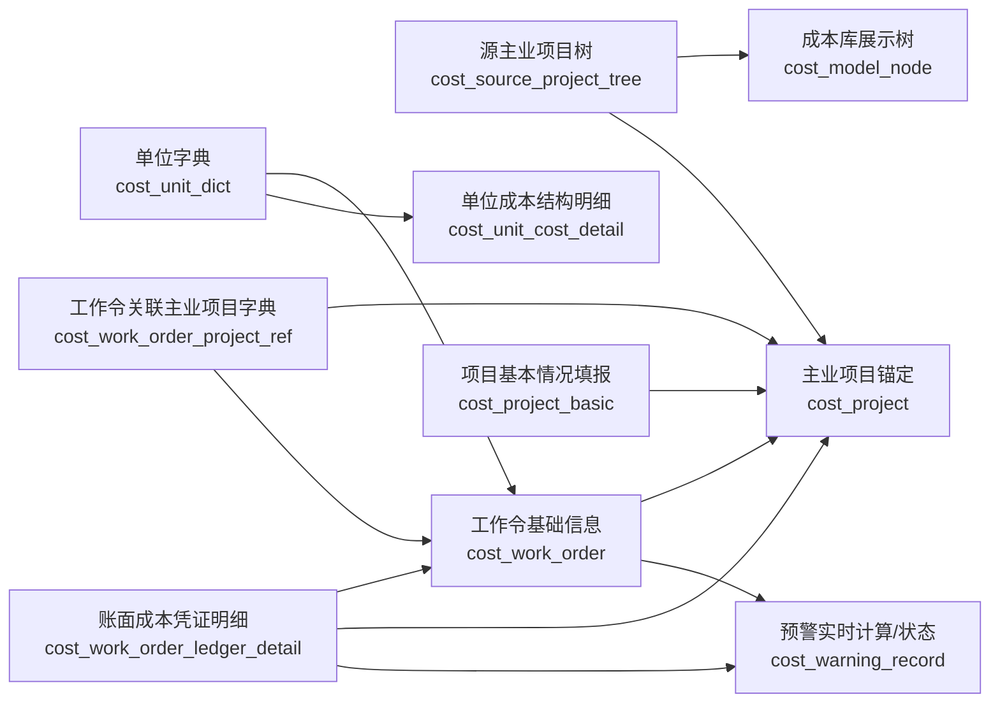

# 05-内网源表与成本库业务表关系实施方案

状态：实施方案草案
更新时间：2026-06-21
负责人：TBD

交接总览：先读 `09-成本库内网数据对接总设计方案.md`，再按本文查看详细实施关系和待确认事项。

## 1. 背景和要解决的问题

成本库当前是从原型逐步落到前端和后端，前期优先做了页面、接口和测试数据闭环。现在内网已有三类真实源数据：

- 主业项目树。
- 工作令关联主业项目字典。
- 项目工作令账面成本明细数据。

这些源数据不能简单等同于当前页面使用的业务表。当前要解决的是：

- 内网这些表能不能直接和成本库表关联使用。
- 阶段、分系统、用户、单位、工作令、主业项目之间到底怎么关联。
- 后台维护是一张表维护，还是通过字典表/中间表连接。
- 是否可以做一个统一后台导入。
- 后续真实数据导入和页面填报怎么避免互相覆盖。

## 2. 总体结论

### 2.1 不建议一张表解决

不建议把主业项目树、工作令映射、凭证明细、项目办填报、研制单位填报都塞进一张大表。原因：

- 数据粒度不同：项目树是节点级，工作令映射是工作令级，账面明细是凭证行级，项目基本情况是项目/分系统/阶段级。
- 维护责任不同：源数据来自内网治理/财务系统，填报数据来自项目办和研制单位。
- 更新频率不同：源字典可增量同步，凭证明细可能按月或按日更新，填报数据有草稿/提交/确认状态。
- 审计要求不同：凭证明细需要保留原始字段，不能被页面编辑覆盖。

### 2.2 推荐三层模型

| 层级 | 定位 | 表 | 是否人工维护 |
|---|---|---|---|
| 源数据层 | 承接内网已有数据，保留原始字段和源主键 | `cost_source_project_tree`、`cost_work_order_project_ref`、`cost_work_order_ledger_detail`、`cost_unit_dict` | 原则上不手工逐条维护，后台导入/同步为主 |
| 业务维护层 | 支撑成本库页面、填报、权限和状态 | `cost_model_node`、`cost_project`、`cost_project_basic`、`cost_work_order` | 可以后台维护、导入、填报 |
| 展示/聚合层 | 支撑成本树、预警、组成饼图、总体展示 | 接口实时聚合；当前保留 `cost_unit_cost_detail` 作为单位成本结构明细 | 不建议手工维护聚合结果，除非后续做快照 |

### 2.3 当前最推荐做法

内网首轮不要让前端页面直接查内网原始表。推荐：

1. 先把内网三类源数据导入成本库自己的源数据表。
2. 再按规则解析到 `cost_model_node`、`cost_project`、`cost_work_order`。
3. 页面仍读取业务表和聚合接口，不直接依赖内网源表字段名。
4. 后台可以做“统一导入中心”，但不同数据类型落不同表、走不同校验和解析流程。

## 3. 表关系总览



核心关系：

| 关系 | 推荐关联键 | 说明 |
|---|---|---|
| 源项目树 -> 成本库项目 | `source_project_id` 优先，其次 `project_code` | 源主键稳定时必须保留；项目编号可用于展示和兜底匹配 |
| 源项目树 -> 展示树 | `parent_source_id` / `parent_path` / `level_no` | 转成 `DOMAIN / SERIES / MODEL` 三层节点 |
| 工作令映射 -> 成本库项目 | `linked_source_project_id` 优先，其次 `linked_project_code` | 映射表决定工作令归属哪个主业项目 |
| 工作令映射 -> 工作令业务表 | `source_work_order_id` 优先，其次 `fiscal_year + work_order_no + accounting_unit_code` | 避免工作令编号跨年度或跨单位重复时混账 |
| 账面明细 -> 工作令业务表 | `source_work_order_id` 优先，其次 `work_order_no + fiscal_year + accounting_unit_code` | 明细导入后写入 `work_order_id` 作为解析结果 |
| 单位字典 -> 工作令/明细 | `accounting_unit_code` 优先，其次 `accounting_unit_name` | 用于院内/院外、管理单位、单位 ID 映射 |

## 4. 每张表的业务定位

### 4.1 `cost_source_project_tree`

定位：源主业项目树，不是前端直接展示树。

当前已开始按内网真实原表整理字段。第一张源表为 `sc_8001_cw.ads_lc_lshsxm2022`，字段说明见 `06-内网原表-主业项目树-ads_lc_lshsxm2022.md`。该原表字段均按 `varchar(255)` 保存，不能直接等同于成本库标准字段，需要先做源表镜像或字段标准化映射。

内网字段示例：

| 内网字段 | 成本库字段 | 用途 |
|---|---|---|
| 项目主键 ID `xmnm` | `source_project_id` | 源系统唯一主键 |
| 主业项目编号 | `project_code` | 项目编号，页面展示和兜底匹配 |
| 主业项目名称 | `project_name` | 项目名称 |
| 主业项目所属类别 | `project_category` | 转系列/类别或保留源类别 |
| 所属领域 | `domain_code` / `domain_name` | 转领域节点 |
| 父路径/上级节点 ID | `parent_path` / `parent_source_id` | 生成树结构 |
| 级数 JS | `level_no` | 判断层级 |
| 备注、自定义字段 | `remark`、`custom_01` 至 `custom_10` | 保留源信息 |

推荐维护方式：

- 后台只提供导入/同步、查询、异常查看。
- 不建议人工逐条编辑源项目树；需要修正时应回源系统或走治理流程。
- 成本库展示树 `cost_model_node` 由它派生，不直接手改后忘记源头。

### 4.2 `cost_model_node`

定位：成本库前端目录树/成本树使用的展示树。

它不是内网原始项目树，而是从源项目树转换得到的“领域 -> 系列 -> 型号/项目”展示结构。

也就是说，`cost_model_node.node_code`、`node_type`、`domain_code` 不是要求内网主业项目树原表必须天然存在这些字段，而是成本库同步/解析时生成的内部字段。

推荐生成规则：

| 展示节点 | 来源建议 |
|---|---|
| 领域 `DOMAIN` | 源项目树 `domain_code/domain_name` 或一级领域口径 |
| 系列 `SERIES` | 源项目树 `project_category` 或二级节点 |
| 型号 `MODEL` | 源项目树第三层项目，或实际主业项目 |

如果内网源项目树不是严格三层，需要先定转换规则，不能让前端自己猜。

字段生成口径建议：

| `cost_model_node` 字段 | 内网主业项目树是否必须提供 | 推荐生成方式 |
|---|---|---|
| `id` | 否 | 成本库自增主键，不能用内网源 ID 直接当主键 |
| `parent_id` | 否 | 根据内网源表 `父路径/上级节点ID` 解析后，指向成本库父节点 `id` |
| `node_code` | 否 | 成本库内部节点编码；推荐用 `node_type + '_' + source_project_id`，或用稳定业务编码生成 |
| `node_name` | 是 | 来自领域名、类别名、主业项目名称 |
| `node_type` | 否 | 成本库内部枚举，按层级/转换规则生成：`DOMAIN`、`SERIES`、`MODEL` |
| `domain_code` | 不一定 | 成本库内部领域编码；源表若有领域编码直接用，没有则按领域名称生成稳定编码 |
| `sort` | 否 | 按源表排序字段、级数、项目编号或导入顺序生成 |
| `status` | 否 | 默认 `ENABLE`；源表停用/删除时转 `DISABLE` |
| `remark` | 否 | 可写源项目 ID、来源说明或异常说明 |

`node_type` 推荐判定：

| 内网源表情况 | `node_type` 生成规则 |
|---|---|
| 源表有明确级数 `JS` 且三级正好是领域/系列/项目 | `JS=1 -> DOMAIN`，`JS=2 -> SERIES`，`JS=3 -> MODEL` |
| 源表第一级不是四个领域，但有“所属领域”字段 | 先按“所属领域”去重生成 `DOMAIN`，再按“主业项目所属类别”生成 `SERIES`，最后按主业项目生成 `MODEL` |
| 源表层级超过三层 | 需要业务确认截取哪三级；多余层级可合并到 `SERIES` 或在 `remark` 保留 |
| 源表缺少类别/系列 | 可以先生成两层树：`DOMAIN -> MODEL`；`SERIES` 可用默认值如“未分系列”【需确认】 |

`domain_code` 推荐判定：

| 源表字段 | 推荐处理 |
|---|---|
| 有领域编码 | 直接写入 `domain_code` |
| 只有领域名称 | 维护一张映射清单，例如 `运载火箭 -> LAUNCH`；没有英文编码要求时也可用源 ID 或拼音首字母 |
| 领域为空 | 进入未解析清单，或落到“未分领域”节点【需确认】 |

`node_code` 不要使用外网测试值，例如 `DOMAIN_LAUNCH`、`SERIES_LAUNCH_A`、`MODEL_LAUNCH_CZ8`。内网建议改为稳定、可追溯的生成方式：

```text
DOMAIN_<领域编码或领域源ID>
SERIES_<领域编码或领域源ID>_<类别编码或类别名称规范化>
MODEL_<源项目主键ID>
```

示例：

| 内网源字段 | 生成结果 |
|---|---|
| 所属领域=`运载火箭`，映射编码=`LAUNCH` | `node_type=DOMAIN`，`node_code=DOMAIN_LAUNCH`，`node_name=运载火箭`，`domain_code=LAUNCH` |
| 主业项目所属类别=`批产改进`，所属领域=`运载火箭` | `node_type=SERIES`，`node_code=SERIES_LAUNCH_批产改进`，`node_name=批产改进`，`domain_code=LAUNCH` |
| 项目主键ID=`xmnm-001`，主业项目名称=`CZ-8A 批产改进` | `node_type=MODEL`，`node_code=MODEL_xmnm-001`，`node_name=CZ-8A 批产改进`，`domain_code=LAUNCH` |

字段生成后，还要把 `cost_project.model_node_id` 指向 `MODEL` 节点，这样目录树点到型号节点时，才能查到对应主业项目和工作令。

### 4.3 `cost_project`

定位：成本库业务项目锚点，是页面、填报、工作令、预警的中心表。

作用：

- 连接前端项目卡片、项目详情、成本树根节点。
- 连接项目基本情况 `cost_project_basic`。
- 连接工作令 `cost_work_order`。
- 提供 `project_id/project_code/project_name` 给账面明细解析。

推荐来源：

- 由 `cost_source_project_tree` 的有效叶子项目生成或更新。
- `project_code`、`project_name`、`domain_name`、`category_name` 等来自源项目树。
- `stage_codes`、`unit_name`、`dept_id`、`owner_user_id` 可由填报或内网组织映射补齐。

### 4.4 `cost_work_order_project_ref`

定位：工作令到主业项目的源映射字典。

当前已开始按内网真实原表整理字段。第二张源表为 `dwd_bd_bfcustomitem_gzl`，字段说明见 `07-内网原表-工作令关联主业项目字典-dwd_bd_bfcustomitem_gzl.md`。该原表字段均按 `varchar(255)` 保存，且截图未看到年度字段，不能直接等同于成本库标准字段，需要先做原表镜像或字段标准化映射。

内网字段示例：

| 内网字段 | 成本库字段 | 用途 |
|---|---|---|
| 工作令 ID | `source_work_order_id` | 源工作令唯一主键 |
| 核算单位编号/名称 | `accounting_unit_code/accounting_unit_name` | 单位归属和去重 |
| 年度 | `fiscal_year` | 区分跨年工作令 |
| 工作令编号/名称 | `work_order_no/work_order_name` | 页面和业务表字段 |
| 是否停用 | `disabled` | 决定是否生成/展示工作令 |
| 关联主业项目编号/名称/ID | `linked_project_code/linked_project_name/linked_source_project_id` | 决定工作令归属项目 |
| 自定义字段 | `custom_01` 至 `custom_10` | 保留源扩展 |

推荐维护方式：

- 后台导入/同步为主。
- 该表是“当前映射状态”的权威来源。
- 如果业务要求历史凭证明细按发生时映射追溯，需要再加历史映射表或保留版本字段【需确认】。

### 4.5 `cost_work_order`

定位：成本库工作令业务表，既承接源映射，也承接研制单位填报字段。

字段分两类：

| 字段类别 | 字段示例 | 来源 |
|---|---|---|
| 源映射字段 | `source_work_order_id`、`project_id`、`project_code`、`accounting_unit_code`、`fiscal_year`、`disabled` | 从 `cost_work_order_project_ref` 同步 |
| 业务填报字段 | `product_target_cost`、`stage_codes`、`max_stage_code`、`subsystem_name`、`product_short_name`、`quantity`、`vertical_division`、`approved_amount`、`status` | 研制单位后台维护/导入/填报 |

结论：

- 工作令关联主业项目字典不能完全替代 `cost_work_order`。
- `cost_work_order` 是页面使用表；映射字典是来源和校验依据。
- 如果只导入映射字典，可以先生成工作令基础行，但目标成本、阶段、分系统、产品简称等仍需填报或另行导入。

### 4.6 `cost_work_order_ledger_detail`

定位：账面成本凭证明细，行粒度是凭证/科目/工作令。

当前已开始按内网真实原表整理字段。第三张源表为 `sc_8001_fidw.dws_bu_pz_pzmx_gzl`，字段说明见 `08-内网原表-项目工作令账面成本明细-dws_bu_pz_pzmx_gzl.md`。该原表字段均按 `varchar(255)` 保存，金额、日期、时间戳都不能直接参与聚合，需要先解析到 `cost_work_order_ledger_detail` 的金额、日期和业务主键字段。

推荐规则：

- 保留源字段：凭证、科目、项目、工作令、金额、记账方向、最后修改时间。
- 导入时解析并写入：
  - `project_id`
  - `work_order_id`
  - `resolved_stage_code`
- 页面不直接列全部凭证明细；通过聚合接口按工作令、阶段、科目 Top8 展示。
- 账面成本优先从此表聚合；没有明细时才用 `cost_work_order.book_cost_amount` 兜底。

内网原表中 `bmid/bmbh/bmmc`、`wldwid/wldwbh/wldwmc`、`bizcode/bizdate`、`settlementdate/settlementnumber` 等字段当前未进入标准明细表。首轮建议保留原表镜像 `cost_source_dws_bu_pz_pzmx_gzl`，避免正式追溯时丢字段；是否扩展标准明细表需结合业务查询需求确认。

### 4.7 `cost_project_basic`

定位：项目办维护的项目基本情况，不是源项目树。

字段如：

- 阶段 `stage_code`
- 分系统/产品配套 `subsystem_name`
- 用户 `user_name`
- 项目获取方式
- 批次/类别
- 承研单位
- 型号项目目标成本
- 研制周期

这些字段不应硬塞进主业项目树，也不建议从账面明细推导。它们属于业务填报数据。

### 4.8 阶段、分系统、用户、单位是不是字典

| 内容 | 当前建议 | 是否新建独立表 |
|---|---|---|
| 阶段 | 先用枚举/中台字典统一编码，如 `M/C/S/D/Z`；表内保存编码 | 不必先新建成本库阶段表，优先用中台字典或固定枚举 |
| 分系统 | 先作为业务文本字段，项目基本情况和工作令都可填写 | 暂不新建，除非业务要求统一选择和统计 |
| 用户 | `project_basic.user_name` 是业务“用户/客户”文本；`owner_user_id` 才是中台账号用户 | 暂不混用 |
| 单位 | 使用 `cost_unit_dict` 作为成本库单位字典，并可映射中台 `dept_id/unit_id` | 已有表，后续补维护/导入 |
| 主业项目树 | 使用 `cost_source_project_tree` 保存源树，派生 `cost_model_node/cost_project` | 需要源表，不建议直接手填展示树 |

## 5. 内网数据能否直接使用

### 5.1 可以直接导入，但不建议直接作为页面查询表

如果内网三张表字段与我们定义不同，有三种做法：

| 做法 | 可行性 | 建议 |
|---|---|---|
| 成本库直接查内网原表 | 技术可行，但耦合高 | 不推荐。字段名、权限、租户、后续变更都会影响页面 |
| 建数据库视图，把内网原表映射成成本库字段 | 可行 | 可作为过渡方案，但仍需维护视图和权限 |
| 导入/同步到成本库源表，再派生业务表 | 可行 | 推荐。成本库有稳定表结构和解析规则 |

### 5.2 当前脚本差异

需要注意：

- `note/30-data/schema-mvp.sql` 里已经设计了 `cost_source_project_tree` 和 `cost_work_order_project_ref`。
- 最新后端部署脚本 `sql/mysql/costree-cost.sql`、`sql/postgresql/costree-cost.sql` 目前只包含 10 张表，未包含这两张源表。
- 最新后端部署脚本已包含标准账面明细表 `cost_work_order_ledger_detail`，但未包含原表镜像 `cost_source_dws_bu_pz_pzmx_gzl`；如果需要保留部门、往来单位、业务号、结算号等完整源字段，需要补镜像表或使用内网原表/视图。
- 如果内网要按本文方案完整维护源项目树和工作令映射，部署脚本需要补齐这两张表，或者明确使用内网现有原表/视图作为源表。

建议内网落地前先做一个决策：

| 选择 | 说明 | 适用场景 |
|---|---|---|
| A. 补齐成本库源表 | 在成本库库内新增 `cost_source_project_tree`、`cost_work_order_project_ref` | 推荐，成本库可独立运行和追溯 |
| B. 使用内网已有原表 | 不新建成本库源表，成本库通过视图/同步 SQL 读原表 | 原表稳定、DBA 允许授权且字段长期不变 |

## 6. 后台维护和导入方案

### 6.1 后台可以统一入口，但不落一张表

建议新增“成本库数据导入中心”后台入口，内部按导入类型分 Tab：

| Tab | 导入类型 | 落表 | 后续动作 |
|---|---|---|---|
| 单位字典 | `UNIT_DICT` | `cost_unit_dict` | 更新院内/院外、单位映射 |
| 主业项目树 | `SOURCE_PROJECT_TREE` | `cost_source_project_tree` | 解析生成 `cost_model_node`、`cost_project` |
| 工作令映射 | `WORK_ORDER_REF` | `cost_work_order_project_ref` | 解析生成/更新 `cost_work_order` 的项目归属和源字段 |
| 项目基本情况 | `PROJECT_BASIC` | `cost_project_basic` | 项目办填报数据 |
| 工作令基础信息 | `WORK_ORDER` | `cost_work_order` | 研制单位填报数据，补目标成本/阶段/分系统等 |
| 账面明细 | `LEDGER_DETAIL` | `cost_work_order_ledger_detail` | 解析 `project_id/work_order_id/resolved_stage_code`，供账面聚合 |

`cost_import_batch` 和 `cost_import_error` 可以继续作为统一导入批次和错误记录表。

### 6.2 推荐导入顺序

内网首轮导入建议顺序：

1. 导入单位字典 `cost_unit_dict`。
2. 导入主业项目树源表 `cost_source_project_tree`。
3. 执行项目树解析，生成或更新 `cost_model_node` 和 `cost_project`。
4. 导入工作令关联主业项目字典 `cost_work_order_project_ref`。
5. 执行工作令映射解析，生成或更新 `cost_work_order` 的源字段、项目归属、核算单位。
6. 导入项目基本情况 `cost_project_basic`，补项目办维护字段。
7. 导入/维护工作令基础信息 `cost_work_order`，补目标成本、阶段、分系统、产品简称、数量等字段。
8. 导入账面成本明细 `cost_work_order_ledger_detail`。
9. 执行账面明细解析，写入 `project_id`、`work_order_id`、`resolved_stage_code`。
10. 用页面和校验 SQL 验证成本树、单位工作令、预警、组成穿透。

### 6.3 统一导入时的错误处理

必须能看到这些异常：

| 异常 | 处理 |
|---|---|
| 源项目父节点不存在 | 当前行进错误表，项目不生成业务表 |
| 项目编号重复但源 ID 不同 | 标为冲突，人工确认 |
| 工作令映射找不到关联主业项目 | 映射导入成功但解析失败，工作令不进入正常展示 |
| 工作令编号跨年度/单位重复 | 必须使用 `source_work_order_id` 或复合键，不按单一 `work_order_no` 覆盖 |
| 账面明细找不到工作令 | 明细保留，但 `work_order_id` 为空，进入未解析列表 |
| 账面明细金额单位不确定 | 先保留 `amount`，`amount_wan` 按确认口径写入 |
| 阶段无法解析 | `resolved_stage_code` 为空，页面按全部汇总可见，阶段筛选需提示异常 |

## 7. 同步和解析规则

### 7.1 主业项目树解析到展示树和项目

输入：`cost_source_project_tree`

输出：

- `cost_model_node`
- `cost_project`

推荐规则：

1. 按 `source_project_id` 做源树唯一键。
2. `level_no` 或 `parent_path` 用来判断层级。
3. 领域节点生成 `DOMAIN`。
4. 类别/系列节点生成 `SERIES`。
5. 叶子主业项目生成 `MODEL` 节点，并生成 `cost_project`。
6. `cost_project.model_node_id` 指向对应 `MODEL` 节点。
7. 源表停用或删除时，不物理删除业务表，先置为 `DISABLE` 或保留历史【需确认】。

待确认：

- 内网主业项目树的第三级是否一定等同于成本库“型号项目”。
- `主业项目所属类别` 是否等同我们页面的“系列”。
- 四个领域的编码和名称是否固定。

### 7.2 工作令映射解析到工作令业务表

输入：`cost_work_order_project_ref`

输出：`cost_work_order`

推荐规则：

1. 按 `source_work_order_id` 查找或创建 `cost_work_order`。
2. 通过 `linked_source_project_id` 或 `linked_project_code` 匹配 `cost_project`。
3. 回填：
   - `project_id`
   - `project_code`
   - `project_name`
   - `source_work_order_id`
   - `accounting_unit_code`
   - `accounting_unit_name`
   - `fiscal_year`
   - `work_order_no`
   - `work_order_name`
   - `disabled`
4. 不覆盖研制单位已经填报的目标成本、阶段、分系统、产品简称、数量，除非导入时明确选择覆盖。

这样可以避免源映射更新时把人工填报内容冲掉。

### 7.3 工作令基础信息维护

输入：后台页面或 Excel 导入。

目标表：`cost_work_order`

维护字段：

- `product_target_cost`
- `stage_codes`
- `max_stage_code`
- `subsystem_name`
- `product_short_name`
- `quantity`
- `vertical_division`
- `approved_amount`
- `status`
- `remark`

要求：

- 维护时必须选择或匹配已存在的项目。
- 如果工作令来源于 `cost_work_order_project_ref`，应优先保留 `source_work_order_id`。
- 工作令关联项目变化时，要记录来源和变更原因【需确认是否需要历史表】。

### 7.4 账面明细解析

输入：`cost_work_order_ledger_detail`

输出：同表解析字段和聚合接口。

推荐规则：

1. 先按 `source_work_order_id` 匹配 `cost_work_order.source_work_order_id`，内网原表候选字段为 `gzlnm`。
2. 匹配不到时，按 `work_order_no + fiscal_year + accounting_unit_code` 兜底，内网原表候选字段为 `gzllb + kjnd + dwbh`。
3. 匹配到工作令后，写入 `work_order_id`、`project_id`。
4. `resolved_stage_code` 优先取工作令 `max_stage_code`；如果为空，再按 `stage_codes` 规则解析【需确认】。
5. 金额聚合优先用 `amount_wan`；为空时按 `amount / 10000` 兜底，这个换算口径必须由财务确认。
6. 借贷方向是否转正负仍需确认；确认前不要把明细作为最终财务口径承诺。

## 8. 页面和接口影响

### 8.1 现有页面保持业务表口径

| 页面 | 当前主要数据来源 | 后续变化 |
|---|---|---|
| `/cost/catalog` | `cost_model_node`、`cost_project`、`cost_work_order` | 树和项目由源项目树派生，工作令由映射字典派生 |
| `/cost/tree-detail` | `cost_project`、`cost_work_order`、`cost_unit_dict`、账面聚合接口 | 账面成本继续优先读 `cost_work_order_ledger_detail` 聚合 |
| `/cost/tree-unit-detail` | `cost_work_order`、账面组成接口 | 工作令项目归属由映射字典保障 |
| `/cost/collect` | `cost_project_basic`、`cost_work_order` | 项目办/研制单位继续维护业务字段 |
| `/cost/warning` | `cost_work_order` + `cost_work_order_ledger_detail` 实时计算 | 映射和账面解析稳定后，预警口径更接近真实 |

### 8.2 后端需要补的能力

当前已有：

- 项目基本情况导入/导出。
- 工作令基础信息导入/导出。
- 工作令账面组成和汇总查询。

建议新增：

| 能力 | 路径建议 | 说明 |
|---|---|---|
| 源主业项目树导入 | `POST /cost/source-project-tree/import` | 导入源项目树 |
| 源主业项目树解析 | `POST /cost/source-project-tree/resolve` | 生成/更新 `cost_model_node`、`cost_project` |
| 工作令映射导入 | `POST /cost/work-order-project-ref/import` | 导入映射字典 |
| 工作令映射解析 | `POST /cost/work-order-project-ref/resolve` | 生成/更新 `cost_work_order` 源字段和项目归属 |
| 账面明细导入 | `POST /cost/work-order-ledger-detail/import` | 导入凭证明细 |
| 账面明细解析 | `POST /cost/work-order-ledger-detail/resolve` | 写入 `project_id/work_order_id/resolved_stage_code` |
| 未解析数据查询 | `GET /cost/source-data/unresolved/page` | 查找未匹配项目、工作令、单位、阶段的数据 |

## 9. 内网首轮落地建议

### 9.1 不改代码也能先做的数据准备

如果马上要内网导入，但后台导入功能还没做完，可以先由数据库脚本导入：

1. 建表。
2. 用 SQL 或 ETL 把内网源表导入成本库源表。
3. 用 SQL 检查未匹配项目、工作令、单位。
4. 手工或脚本生成 `cost_model_node`、`cost_project`、`cost_work_order`。
5. 启动后端和前端验证页面。

但这只是首轮验证，不建议长期靠手写 SQL 维护。

### 9.2 内网正式维护推荐路径

正式维护建议做后台统一导入中心：

- 管理员上传/同步源项目树、工作令映射、账面明细。
- 系统写入源表和导入批次。
- 管理员点击“解析/同步到业务表”。
- 系统生成业务表并给出异常报告。
- 项目办和研制单位再在 `/cost/collect` 或后台维护页补充目标成本、阶段、分系统、产品简称等业务字段。

## 10. 当前必须补齐或确认的事项

### 10.1 技术必须补齐

| 事项 | 原因 | 建议优先级 |
|---|---|---|
| 决定是否把 `cost_source_project_tree`、`cost_work_order_project_ref` 加入最新 MySQL/PostgreSQL 部署 DDL | 现有内网源数据要有承接表 | P0 |
| 增加源项目树和工作令映射的导入/解析能力 | 否则只能手工 SQL 维护 | P0 |
| 增加未解析数据查询 | 内网真实数据一定会有匹配失败 | P0 |
| 明确工作令唯一键 | 避免跨年度/单位重复覆盖 | P0 |
| 明确账面明细金额和借贷方向 | 影响所有超支预警 | P0 |

### 10.2 业务必须确认

| 问题 | 影响 |
|---|---|
| 主业项目树第几层是成本库“型号项目” | 影响 `cost_model_node` 和 `cost_project` 生成 |
| 主业项目所属类别是否等同“系列” | 影响目录树展示 |
| 工作令映射变化后历史账面明细是否追溯 | 影响审计和历史成本 |
| 阶段编码和排序规则 | 影响 `max_stage_code` 和阶段筛选 |
| 分系统是否需要统一字典 | 影响填报和统计 |
| 用户字段是客户名称还是中台用户 | 影响是否关联 `system_users` |
| 院本级支出判断规则 | 影响院内/院外/院本级分类 |

## 11. 对你的直接建议

当前你应该按这个顺序推进：

1. 先确认内网三张源表是否允许复制到成本库库内；如果允许，选择“补齐成本库源表”方案。
2. 让 DBA 或你自己先不要把三张源表直接覆盖 `cost_project`、`cost_work_order`。
3. 先补齐部署 DDL 中缺少的 `cost_source_project_tree`、`cost_work_order_project_ref`，或者用视图映射到这两个表名。
4. 首轮用数据库脚本导入源数据，跑匹配检查，拿到未匹配清单。
5. 再实现后台统一导入中心，不要一开始就让业务人员直接编辑源明细。
6. 项目办/研制单位录入的阶段、分系统、用户、目标成本等内容继续进 `cost_project_basic` 和 `cost_work_order`，不要写回源项目树或账面明细。

## 12. 一句话口径

内网已有的主业项目树、工作令关联字典、账面明细可以作为成本库真实数据来源，但不应直接替代现有业务表。推荐把它们作为源数据层导入，再解析生成 `cost_model_node`、`cost_project`、`cost_work_order`，项目办和研制单位录入的数据继续维护在业务表中，账面成本从凭证明细聚合，后台统一入口导入但分表落库、分流程解析。
