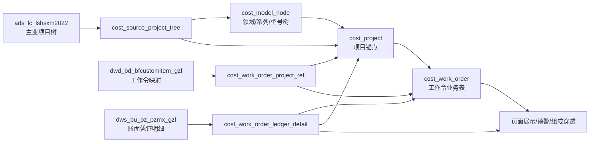

# 09-成本库内网数据对接总设计方案

状态：实施交接稿
更新时间：2026-06-21
适用对象：项目负责人、内网 DBA、后端开发、前端开发、后续接手人员

## 1. 设计结论

成本库不要直接把内网三张原表当页面业务表使用。推荐按下面四层落地：

```text
内网原表/源数据层
  -> 成本库标准源层
  -> 成本库业务维护层
  -> 页面展示和实时聚合层
```

核心原因：

- 内网原表字段多为 `varchar(255)`，金额、日期、层级、停用状态都需要解析。
- 内网主业项目树不一定天然等同成本库前端需要的“领域 -> 系列 -> 型号”展示树。
- 工作令关联主业项目字典只说明工作令归属，不包含目标成本、阶段、分系统等成本库填报字段。
- 账面明细是凭证行粒度，适合做账面聚合和科目组成，不适合作为项目或工作令业务主表。
- 主页汇总、账面成本、预警第一阶段按业务表和明细实时聚合，不建议一开始单独维护汇总表。

## 2. 总体设计表

| 层级 | 表/来源 | 业务定位 | 为什么这样设计 | 维护方式 |
|---|---|---|---|---|
| 内网原表 | `ads_lc_lshsxm2022` | 主业项目树原始数据 | 字段全是字符串，层级口径和成本库展示树不一定一致 | DBA/源系统维护，成本库只读/同步 |
| 内网原表 | `dwd_bd_bfcustomitem_gzl` | 工作令关联主业项目字典 | 决定工作令归属哪个主业项目，但不包含全部成本库填报字段 | DBA/源系统维护，成本库同步 |
| 内网原表 | `dws_bu_pz_pzmx_gzl` | 工作令账面凭证明细 | 行粒度是凭证明细，适合做账面聚合和科目组成 | 财务源系统维护，成本库同步 |
| 标准源层 | `cost_source_project_tree` | 成本库承接主业项目树的标准源表 | 隔离内网原表字段名和成本库业务字段 | 导入/同步生成，不建议人工编辑 |
| 标准源层 | `cost_work_order_project_ref` | 工作令到主业项目的标准映射表 | 保留“工作令归属项目”的权威来源 | 导入/同步生成，不覆盖填报字段 |
| 业务展示树 | `cost_model_node` | `/cost/catalog` 左侧领域-系列-型号树 | 前端需要稳定的 `id/parent_id/node_type` 树结构 | 由项目树解析生成，少量字典映射可维护 |
| 项目锚点 | `cost_project` | 项目卡片、项目详情、成本树根项目 | 一个项目的统一入口，连接树、工作令、填报、账面 | 由项目树叶子/型号节点生成，可补业务字段 |
| 项目填报 | `cost_project_basic` | 项目办维护阶段、周期、用户等项目基本情况 | 这些不是主业项目树原始字段，应独立维护 | 项目办填报/导入 |
| 工作令业务 | `cost_work_order` | 工作令列表、目标成本、阶段、分系统、账面兜底 | 映射表只说明归属，目标成本等仍需业务维护 | 从映射表生成基础行，再由研制单位填报 |
| 账面明细 | `cost_work_order_ledger_detail` | 账面成本、超支预警、Top8 科目组成 | 原表金额/日期都是字符串，需标准化后聚合 | 从凭证明细导入解析 |
| 单位字典 | `cost_unit_dict` | 院内/院外、核算单位、管理单位映射 | 统一单位口径，避免靠名称硬匹配 | 从单位字典导入，可后台维护 |

## 3. 核心表对应关系

| 成本库表 | 上游来源 | 关键关联字段 | 页面用途 | 维护/导入原则 |
|---|---|---|---|---|
| `cost_model_node` | `cost_source_project_tree` | `id`、`parent_id`、`node_type`、`node_code` | `/cost/catalog` 左侧树、成本树筛选 | 不直接照搬内网字段，由解析规则生成 |
| `cost_project` | `cost_source_project_tree` | `model_node_id`、`project_code`、`source_project_id` | 项目卡片、项目详情、成本树根节点 | 一个可展示项目生成一条，必须挂到 `MODEL` 节点 |
| `cost_work_order_project_ref` | `dwd_bd_bfcustomitem_gzl` | `source_work_order_id`、`linked_source_project_id`、`linked_project_code` | 工作令归属解析 | 只做源映射，不存目标成本等填报字段 |
| `cost_work_order` | `cost_work_order_project_ref` + 填报 | `project_code`、`work_order_no`、`source_work_order_id` | 工作令卡片/列表、目标成本、阶段、分系统 | 源映射更新时不覆盖人工填报字段 |
| `cost_work_order_ledger_detail` | `dws_bu_pz_pzmx_gzl` | `source_detail_id`、`source_work_order_id`、`work_order_no`、`project_id` | 账面成本、预警、科目组成 | 明细导入后解析 `project_id/work_order_id` |
| `cost_project_basic` | 项目办填报/导入 | `project_id/project_code` | 填报页、项目基本信息 | 业务维护表，不从账面明细推导 |

## 4. 为什么拆分 `cost_model_node` 和 `cost_project`

`cost_model_node` 是展示树，`cost_project` 是业务项目锚点。两者不能合并。

| 问题 | 如果只用一张表 | 现在拆分后的处理 |
|---|---|---|
| 内网树可能不是三层 | 前端树逻辑会被源树结构绑死 | `cost_model_node` 生成成本库自己的领域-系列-型号树 |
| 同一项目需要展示、填报、挂工作令 | 树节点会塞入大量业务字段 | `cost_project` 做项目业务锚点 |
| 节点可能是领域/系列，不是项目 | 会出现没有项目意义的业务行 | 只有 `MODEL` 或明确叶子项目生成 `cost_project` |
| 内网字段没有 `node_type` | 前端无法判断“领/系/型” | 解析时按业务规则生成 `DOMAIN/SERIES/MODEL` |
| 后续源树口径变化 | 页面和业务数据都受影响 | 源树重新解析，业务表保留稳定项目锚点 |

### 4.1 `cost_model_node` 的定位

`cost_model_node` 服务前端目录树和成本树筛选，不是内网主业项目树的原样拷贝。

关键字段含义：

| 字段 | 说明 | 生成方式 |
|---|---|---|
| `id` | 成本库内部节点主键 | 成本库自增或导入生成，不直接使用内网源 ID |
| `parent_id` | 成本库内部父节点 ID | 根据源树父节点解析后指向成本库父节点 |
| `node_code` | 成本库内部节点编码 | 推荐用 `DOMAIN_<编码>`、`SERIES_<编码>`、`MODEL_<源项目ID>` 生成 |
| `node_name` | 前端显示名称 | 来自领域名、类别名、主业项目名称 |
| `node_type` | 前端层级类型 | 解析生成 `DOMAIN`、`SERIES`、`MODEL` |
| `domain_code` | 领域编码 | 有源编码则用源编码，没有则维护领域名称映射 |
| `sort` | 前端排序 | 按源表排序、级数、编号或导入顺序生成 |
| `status` | 是否启用 | 源表停用/禁用时转 `DISABLE`，否则 `ENABLE` |

### 4.2 `cost_project` 的定位

`cost_project` 是成本库项目中心表。页面看到的项目卡片、项目详情、成本树根项目、工作令归属都依赖它。

关键要求：

- 每个可展示的主业项目生成一条 `cost_project`。
- `cost_project.model_node_id` 必须指向对应的 `cost_model_node` 型号节点。
- `cost_project.project_code` 必须和 `cost_work_order.project_code` 保持一致。
- `cost_project.source_project_id` 建议保存内网源项目 ID，便于后续同步和追溯。

## 5. 内网三张表到成本库的映射路径

| 内网表 | 第一步 | 第二步 | 第三步 | 结果 |
|---|---|---|---|---|
| `ads_lc_lshsxm2022` 主业项目树 | 原样镜像或导入 `cost_source_project_tree` | 确认父节点、级数、叶子节点、领域/类别规则 | 生成 `cost_model_node` 和 `cost_project` | 目录树和项目卡片可展示 |
| `dwd_bd_bfcustomitem_gzl` 工作令映射 | 原样镜像或导入 `cost_work_order_project_ref` | 用 `zyxmid/zyxmcode` 匹配 `cost_project` | 生成/更新 `cost_work_order` 的项目归属 | 项目下能看到工作令 |
| `dws_bu_pz_pzmx_gzl` 账面明细 | 导入 `cost_work_order_ledger_detail` | 用 `gzlnm/gzllb` 匹配 `cost_work_order` | 聚合金额和科目 Top8 | 账面成本、预警、组成穿透可用 |

推荐流程图：



## 6. `/cost/catalog` 页面取数逻辑

| 页面区域 | 后端接口 | 数据表 | 关键逻辑 |
|---|---|---|---|
| 左侧树 | `/cost/model-node/tree` | `cost_model_node` | 按 `parent_id` 组树，按 `node_type` 显示“领/系/型” |
| 右侧项目卡片 | `/cost/project/page` | `cost_project` | 选中领域/系列/型号后，用 `domainName/categoryName/model_node_id` 过滤 |
| 项目范围工作令数 | `/cost/work-order/page` | `cost_work_order` | 用当前项目 `project_code` 集合查询工作令 |
| 账面成本 | `/cost/work-order-ledger/summary` | `cost_work_order_ledger_detail` | 优先明细聚合，无明细时用 `cost_work_order.book_cost_amount` 兜底 |
| 本页汇总 | 前端按当前页数据计算 | `cost_work_order` + 明细聚合结果 | 当前不是单独汇总表 |

### 6.1 左侧树维护规则

`/cost/catalog` 左侧树只来自 `cost_model_node`。

最小维护条件：

| 要素 | 要求 |
|---|---|
| 领域节点 | `node_type=DOMAIN`，`parent_id=0` |
| 系列节点 | `node_type=SERIES`，`parent_id` 指向领域节点 |
| 型号节点 | `node_type=MODEL`，`parent_id` 指向系列节点或领域节点 |
| 项目绑定 | `cost_project.model_node_id` 指向型号节点 `id` |

### 6.2 项目卡片维护规则

项目卡片来自 `cost_project`。

卡片常用字段：

| 卡片内容 | 来源字段 |
|---|---|
| 项目名称 | `project_name` |
| 项目编号 | `project_code` |
| 所属领域 | `domain_name` |
| 系列/类别 | `category_name` |
| 批次/项目 | `batch_no` 或 `model_name` |
| 当前阶段 | `stage_codes` |
| 承研单位 | `unit_name` |
| 填报状态 | `project_office_status` |

筛选关系建议：

| 筛选节点 | 推荐匹配方式 |
|---|---|
| 领域 | `cost_project.domain_name = cost_model_node.node_name`，后续可统一改为编码匹配 |
| 系列 | `cost_project.category_name = cost_model_node.node_name`，或 `category_code = node_code` |
| 型号 | 优先 `cost_project.model_node_id = cost_model_node.id` |

因此，内网导入时最稳的是写准 `model_node_id`。不要只靠项目名称模糊匹配。

## 7. 导入和维护步骤

| 步骤 | 操作 | 输出 | 验证点 |
|---|---|---|---|
| 1 | 导入单位字典 | `cost_unit_dict` | 单位编号、单位名称、院内/院外口径正确 |
| 2 | 导入主业项目树 | `cost_source_project_tree` 或源镜像 | 源主键、父节点、级数完整 |
| 3 | 解析项目树 | `cost_model_node`、`cost_project` | 左侧树能展开，型号节点能找到项目卡片 |
| 4 | 导入工作令映射 | `cost_work_order_project_ref` | 工作令能匹配到主业项目 |
| 5 | 解析工作令 | `cost_work_order` | 项目卡片下工作令数量正确 |
| 6 | 维护业务字段 | `cost_project_basic`、`cost_work_order` | 阶段、分系统、目标成本、用户、周期完整 |
| 7 | 导入账面明细 | `cost_work_order_ledger_detail` | 金额、年度、期间、科目、工作令编号正确 |
| 8 | 解析账面归属 | 回填 `project_id/work_order_id/resolved_stage_code` | 账面成本和工作令组成能聚合出来 |
| 9 | 页面核验 | `/cost/catalog`、`/cost/tree-detail`、`/cost/tree-unit-detail` | 项目、工作令、目标、账面、预警一致 |

## 8. 首轮两个型号试点操作

内网首轮不要一次性导入全部真实数据。建议先选两个型号试点。

| 事项 | 做法 |
|---|---|
| 选数据 | 从内网主业项目树选 2 个明确叶子/型号项目 |
| 建树 | 只生成这 2 个型号对应的领域、系列、型号节点 |
| 建项目 | 每个型号生成一条 `cost_project`，写好 `model_node_id/project_code/project_name` |
| 挂工作令 | 从工作令映射表筛出这 2 个项目关联工作令，生成 `cost_work_order` |
| 补填报 | 给试点工作令补目标成本、阶段、分系统、单位 |
| 导账面 | 只导入这 2 个型号相关账面明细 |
| 验证 | 先看 `/cost/catalog` 是否筛选正确，再看成本树账面和预警是否正确 |

试点验收顺序：

1. `/cost/catalog` 左侧树能看到领域、系列、型号。
2. 点击型号节点，只出现对应项目卡片。
3. 项目卡片显示正确项目编号、领域、系列、阶段、承研单位。
4. 当前范围工作令数量正确。
5. 进入成本树后，单位节点和工作令节点账面成本正确。
6. 账面/目标达到 80% 显示黄色，超过目标显示红色。
7. 工作令组成穿透能看到 Top8 科目；没有明细时显示空态。

## 9. 必须确认的口径

| 待确认项 | 影响 |
|---|---|
| `ads_lc_lshsxm2022` 哪个字段是稳定项目源 ID | 决定 `source_project_id` |
| 哪个父节点字段有效：`parent_xmnm/lshsxm_fjnm/nfjm/nparent_xmnm` | 决定树结构 |
| 主业项目树哪一级是成本库“型号项目” | 决定哪些节点生成 `cost_project` |
| 领域、系列从哪里来 | 决定 `DOMAIN/SERIES/MODEL` 生成规则 |
| `dwd_bd_bfcustomitem_gzl.zyxmid` 对应项目树哪个字段 | 决定工作令能否准确挂项目 |
| 工作令编号是否跨年度/跨单位重复 | 决定 `cost_work_order` 唯一键 |
| `dws_bu_pz_pzmx_gzl.je` 单位和 `jzfx` 正负规则 | 决定账面成本和超支预警 |
| 历史账面是否按当前映射重算 | 决定审计追溯方式 |

## 10. 与现有专题文档的关系

| 文档 | 作用 |
|---|---|
| `05-内网源表与成本库业务表关系实施方案.md` | 详细说明源数据层、业务维护层、展示聚合层的整体实施方案 |
| `06-内网原表-主业项目树-ads_lc_lshsxm2022.md` | 记录第一张内网原表字段清单和主业项目树映射待确认项 |
| `07-内网原表-工作令关联主业项目字典-dwd_bd_bfcustomitem_gzl.md` | 记录第二张内网原表字段清单和工作令映射待确认项 |
| `08-内网原表-项目工作令账面成本明细-dws_bu_pz_pzmx_gzl.md` | 记录第三张内网原表字段清单和账面明细映射待确认项 |
| 本文档 | 面向交接和执行的总设计表，帮助没接触过项目的人快速理解为什么这样分表、如何导入、如何维护 |

## 11. 当前默认假设

- 内网原表可以通过数据库同步、视图或离线导入进入成本库环境。
- 首轮目标是让页面用真实数据跑通，不要求一次性建设完整数据治理平台。
- 当前不新增主页汇总物化表；百万级账面明细先靠标准明细表索引和 SQL 聚合，后续再按性能结果决定是否做快照/汇总表。
- `cost_model_node` 是成本库展示树，不要求内网原表天然提供 `node_code/node_type/domain_code`。
- `cost_project` 是成本库项目锚点，后续工作令、账面明细、填报数据都应能追溯到它。

## 12. 字段级表结构说明

本章节用于给内网 DBA、后端开发和后续接手人员做字段级交接。字段口径按以下来源区分：

| 来源标记 | 含义 |
|---|---|
| 当前部署 DDL 已包含 | 来自 `<backend-root>/sql/mysql/costree-cost.sql` 和 PostgreSQL 同名脚本，当前后端部署脚本已建表 |
| MVP/schema 设计已有但部署脚本未包含 | 来自 `schema-mvp.sql` 的标准源表设计，当前最新部署脚本暂未包含，内网建库前需补齐或用原表/视图替代 |
| 内网截图整理，待正式 DDL 复核 | 来自内网截图和字段注释整理，字段类型暂按 `varchar(255)` 理解，必须用正式 DDL 和样例数据复核 |

通用字段说明：成本库业务表默认包含 `creator`、`create_time`、`updater`、`update_time`、`deleted`、`tenant_id`。这些是若依/中台通用审计、逻辑删除和租户字段，本文不在每张表重复展开。

### 12.1 `ads_lc_lshsxm2022` 主业项目树原表

表定位：内网主业项目树原始表。
数据来源：内网 `sc_8001_cw.ads_lc_lshsxm2022`。
维护方式：DBA/源系统维护，成本库只同步或镜像，不建议人工改原表。
关键关联：优先确认 `lshsxm_xmnm` 是否可作为成本库 `source_project_id`；父节点字段需用样例数据确认。

| 字段名 | 类型 | 中文说明 | 来源/维护方式 | 关联或页面用途 | 备注/待确认 |
|---|---|---|---|---|---|
| `lshsxm_id` | `varchar(255)` | 主键 | 内网原表 | 原表行唯一标识 | 与 `lshsxm_xmnm` 谁更稳定需确认 |
| `lshsxm_xmnm` | `varchar(255)` | 项目内码 | 内网原表 | 推荐映射 `cost_source_project_tree.source_project_id` | 优先作为项目源 ID 候选 |
| `lshsxm_xmbh` | `varchar(255)` | 项目编号 | 内网原表 | 映射 `project_code` | 可作为项目兜底匹配键 |
| `lshsxm_xmmc` | `varchar(255)` | 项目名称 | 内网原表 | 映射 `project_name`、展示节点名称 | 名称只做展示和校验，不建议唯一匹配 |
| `lshsxm_js` | `varchar(255)` | 级数 | 内网原表 | 判断源树层级 | 哪一级等同成本库“型号项目”需确认 |
| `lshsxm_mx` | `varchar(255)` | 明细 | 内网原表 | 判断是否叶子/明细节点 | 取值含义需样例确认 |
| `lshsxm_dwbh` | `varchar(255)` | 单位编号 | 内网原表 | 可对接单位字典 | 当前标准项目树源表未单独列出，建议保留 |
| `lshsxm_fjnm` | `varchar(255)` | 父级内码 | 内网原表 | 父子关系候选 | 需与 `parent_xmnm` 比较 |
| `parent_xmnm` | `varchar(255)` | 上级项目内码 | 内网原表 | 父子关系候选 | 需确认是否当前有效父节点字段 |
| `lshsxm_xmlx` | `varchar(255)` | 项目类型 | 内网原表 | 候选项目类别/系列 | 是否等同“主业项目所属类别”需确认 |
| `lshsxm_ms` | `varchar(255)` | 是否免税 | 内网原表 | 暂保留源字段 | 页面当前不用 |
| `seclevel` | `varchar(255)` | 密级 | 内网原表 | 后续权限/脱敏候选 | 是否接中台密级需确认 |
| `lshsxm_zt` | `varchar(255)` | 状态 | 内网原表 | 生成成本库 `status` 候选 | 有效/停用取值需确认 |
| `disabled` | `varchar(255)` | 禁用状态 | 内网原表 | 生成 `DISABLE` 候选 | 与 `lshsxm_zt` 优先级需确认 |
| `nfjm` | `varchar(255)` | 新父级码 | 内网原表 | 新口径父级候选 | 是否优先于旧父级字段需确认 |
| `nxmnm` | `varchar(255)` | 新核算编码 | 内网原表 | 新口径项目编码候选 | 是否替代 `lshsxm_xmnm` 需确认 |
| `nparent_xmnm` | `varchar(255)` | 新上级编码 | 内网原表 | 新口径父节点候选 | 需和 `parent_xmnm` 对比 |
| `jyrq` | `varchar(255)` | 禁用日期 | 内网原表 | 停用判断和审计 | 日期格式需确认 |
| `wglx` | `varchar(255)` | 完工类型 | 内网原表 | 暂保留源字段 | 后续是否影响过滤需确认 |
| `xmsx` | `varchar(255)` | 项目属性 | 内网原表 | 项目分类候选 | 是否参与领域/系列规则需确认 |

### 12.2 `cost_source_project_tree` 标准源主业项目树

表定位：成本库承接内网主业项目树的标准源表，不是前端直接展示树。
数据来源：`ads_lc_lshsxm2022` 解析或镜像后标准化。
维护方式：导入/同步生成，不建议人工逐条编辑。
关键关联：向下生成 `cost_model_node` 和 `cost_project`。

| 字段名 | 类型 | 中文说明 | 来源/维护方式 | 关联或页面用途 | 备注/待确认 |
|---|---|---|---|---|---|
| `id` | `bigint` | 成本库源表主键 | 成本库生成 | 内部主键 | MVP/schema 设计已有但部署脚本未包含 |
| `source_project_id` | `varchar(64)` | 源项目主键 ID | 来自 `lshsxm_xmnm` 或确认后的源主键 | 关联工作令映射、账面明细源项目 | 必须确认稳定唯一 |
| `project_code` | `varchar(64)` | 主业项目编号 | 来自 `lshsxm_xmbh` | 生成 `cost_project.project_code` | 兜底匹配键 |
| `project_name` | `varchar(200)` | 主业项目名称 | 来自 `lshsxm_xmmc` | 生成项目名称和节点名称 | 展示字段 |
| `project_category` | `varchar(128)` | 主业项目所属类别 | 来自 `lshsxm_xmlx` 或外部类别字段 | 生成系列/类别候选 | 是否等同系列需确认 |
| `domain_code` | `varchar(64)` | 所属领域编码 | 源字段或领域映射表生成 | 生成领域节点、项目领域 | 当前内网截图未见直接领域编码 |
| `domain_name` | `varchar(128)` | 所属领域名称 | 源字段或领域映射表生成 | 页面领域展示 | 领域来源需确认 |
| `parent_source_id` | `varchar(64)` | 上级源节点 ID | 来自有效父节点字段 | 解析源树父子关系 | `parent_xmnm/lshsxm_fjnm/nfjm/nparent_xmnm` 待选 |
| `parent_path` | `varchar(1000)` | 父路径 | 导入解析生成或源表提供 | 校验树结构 | 可辅助处理多级树 |
| `level_no` | `int` | 源树级数 | `lshsxm_js` 转数值 | 判断领域/系列/型号候选 | 层级口径需确认 |
| `source_lastmodify` | `datetime` | 源系统最后修改时间 | 原表更新时间字段 | 增量同步 | 截图暂未确认字段 |
| `custom_01` 至 `custom_10` | `varchar(255)` | 源扩展字段 | 保存免税、密级、停用、新编码等 | 追溯源字段 | 正式可按需要扩展为明确字段 |
| `remark` | `varchar(500)` | 备注 | 导入/人工补充 | 异常说明 | 可记录源表名和解析问题 |

### 12.3 `cost_model_node` 成本库展示树节点

表定位：前端 `/cost/catalog` 左侧树和成本树筛选使用的领域/系列/型号树。
数据来源：由 `cost_source_project_tree` 或内网原表视图解析生成。
维护方式：解析任务生成，少量领域/系列映射可配置维护。
关键关联：`cost_project.model_node_id` 指向 `MODEL` 节点。

| 字段名 | 类型 | 中文说明 | 来源/维护方式 | 关联或页面用途 | 备注/待确认 |
|---|---|---|---|---|---|
| `id` | `bigint` | 节点主键 | 成本库生成 | `cost_project.model_node_id` 引用 | 当前部署 DDL 已包含 |
| `parent_id` | `bigint` | 父节点编号 | 由源树父子关系解析生成 | 前端组树 | 根节点通常为 `0` 或空，需保持一致 |
| `node_code` | `varchar(128)` | 节点编码 | 解析生成 | 前端筛选、数据追溯 | 内网原表不提供，推荐稳定生成 |
| `node_name` | `varchar(255)` | 节点名称 | 领域名/系列名/项目名 | 前端显示 | 必填 |
| `node_type` | `varchar(32)` | 节点类型 | 解析生成 `DOMAIN/SERIES/MODEL` | 前端显示“领/系/型” | 不从原表直接照搬 |
| `domain_code` | `varchar(128)` | 所属领域编码 | 源字段或映射生成 | 领域筛选、项目归类 | 系列和型号节点也应保留领域 |
| `sort` | `int` | 排序 | 源排序、编号或导入顺序 | 前端树排序 | 默认 0 |
| `status` | `varchar(32)` | 状态 | 源停用字段解析 | 控制是否展示 | `ENABLE/DISABLE` |
| `remark` | `varchar(500)` | 备注 | 解析任务写入 | 记录源 ID、异常说明 | 可保留来源 |

### 12.4 `cost_project` 成本库项目锚点

表定位：成本库项目中心表，连接目录树、项目卡片、项目详情、工作令和账面明细。
数据来源：由主业项目树叶子/型号项目解析生成，并可补充填报状态。
维护方式：解析生成基础行，后续后台维护业务属性。
关键关联：`model_node_id -> cost_model_node.id`，`project_code -> cost_work_order.project_code`。

| 字段名 | 类型 | 中文说明 | 来源/维护方式 | 关联或页面用途 | 备注/待确认 |
|---|---|---|---|---|---|
| `id` | `bigint` | 项目主键 | 成本库生成 | 工作令、项目基本情况、账面明细可引用 | 当前部署 DDL 已包含 |
| `project_code` | `varchar(128)` | 主业项目编号 | 源项目树 `project_code` | 项目卡片、工作令归属、账面兜底匹配 | 应保持稳定唯一 |
| `project_name` | `varchar(255)` | 主业项目名称 | 源项目树 | 项目卡片、成本树根节点 | 展示字段 |
| `model_node_id` | `bigint` | 型号树节点编号 | 项目树解析写入 | 点击型号节点过滤项目 | 必须指向 `MODEL` 节点 |
| `domain_code` | `varchar(128)` | 所属领域编码 | 源项目树或映射生成 | 总体展示、目录筛选 | 领域编码规则需统一 |
| `domain_name` | `varchar(255)` | 所属领域名称 | 源项目树或映射生成 | 卡片展示、当前前端领域匹配 | 名称需与领域节点一致 |
| `category_code` | `varchar(128)` | 类别/系列编码 | 源项目类型或映射生成 | 系列筛选 | 可后续改为编码强匹配 |
| `category_name` | `varchar(255)` | 类别/系列名称 | 源项目类型或映射生成 | 卡片展示、系列匹配 | 名称需与系列节点一致 |
| `model_code` | `varchar(128)` | 型号/项目编码 | 源项目 ID 或编号生成 | 型号展示和追溯 | 可与 `node_code` 不同 |
| `model_name` | `varchar(255)` | 型号/项目名称 | 源项目名称 | 卡片批次/项目展示 | 展示字段 |
| `batch_no` | `varchar(128)` | 批次 | 项目填报或源字段 | 项目卡片展示 | 可为空 |
| `stage_codes` | `varchar(255)` | 阶段集合 | 填报/工作令汇总 | 卡片当前阶段 | 逗号分隔 |
| `unit_id` | `bigint` | 单位编号 | 填报或单位映射 | 承研单位关联 | 中台单位 ID 待确认 |
| `unit_name` | `varchar(255)` | 单位名称 | 填报或单位映射 | 项目卡片承研单位 | 需与单位字典对齐 |
| `unit_type` | `varchar(64)` | 单位属性 | 填报/导入 | 分类展示 | 取值待确认 |
| `project_office_status` | `varchar(32)` | 项目办填报状态 | 项目办填报流程 | 卡片填报状态 | `NOT_FILLED/PART_FILLED/FILLED` |
| `unit_fill_status` | `varchar(32)` | 研制单位填报状态 | 研制单位填报流程 | 进度和统计 | 取值同上 |
| `audit_status` | `varchar(32)` | 审批/提交状态 | 轻流程状态 | 填报流转 | `DRAFT/SUBMITTED/APPROVED/REJECTED` |
| `dept_id` | `bigint` | 数据权限部门编号 | 中台组织映射 | 数据权限 | 真实组织映射待确认 |
| `owner_user_id` | `bigint` | 项目负责人用户编号 | 中台用户映射 | 权限和待办 | 是否使用中台用户需确认 |
| `warning_status` | `varchar(32)` | 预警状态 | 实时计算或状态回写 | 预警展示 | 当前预警主要实时计算 |
| `remark` | `varchar(500)` | 备注 | 人工维护/导入 | 补充说明 | 可记录源项目 ID |

### 12.5 `dwd_bd_bfcustomitem_gzl` 工作令关联主业项目字典原表

表定位：内网工作令到主业项目的原始映射字典。
数据来源：内网 `dwd_bd_bfcustomitem_gzl`。
维护方式：DBA/源系统维护，成本库同步。
关键关联：`zyxmid/zyxmcode` 匹配主业项目，`id/cusitemcode` 匹配工作令。

| 字段名 | 类型 | 中文说明 | 来源/维护方式 | 关联或页面用途 | 备注/待确认 |
|---|---|---|---|---|---|
| `id` | `varchar(255)` | 内码 | 内网原表 | 推荐映射 `source_work_order_id` | 是否稳定唯一需确认 |
| `accountorg` | `varchar(255)` | 核算组织 ID | 内网原表 | 单位源 ID | 可保留追溯 |
| `accountorgcode` | `varchar(255)` | 核算组织编码 | 内网原表 | 映射 `accounting_unit_code` | 与单位字典对齐 |
| `accountorgname` | `varchar(255)` | 核算组织名称 | 内网原表 | 映射 `accounting_unit_name` | 与账面明细单位核对 |
| `cusitemcategory` | `varchar(255)` | 项目类别 ID | 内网原表 | 工作令分类 | 暂保留 |
| `cusitemcode` | `varchar(255)` | 工作令编号 | 内网原表 | 映射 `work_order_no` | 是否跨年度/单位重复需确认 |
| `cusitemname` | `varchar(255)` | 工作令名称 | 内网原表 | 映射 `work_order_name` | 展示字段 |
| `cusitemproperty` | `varchar(255)` | 项目类型 | 内网原表 | 分类候选 | 暂保留 |
| `yjname` | `varchar(255)` | 一级分类名称 | 内网原表 | 工作令分类 | 暂保留 |
| `ejname` | `varchar(255)` | 二级分类名称 | 内网原表 | 工作令分类 | 暂保留 |
| `ifstopname` | `varchar(255)` | 是否停用 | 内网原表 | 生成停用状态候选 | 需确认取值 |
| `iscompleted` | `varchar(255)` | 完工否 | 内网原表 | 状态候选 | 是否影响展示需确认 |
| `isdisabled` | `varchar(255)` | 停用标记 | 内网原表 | 映射 `disabled` | 与 `ifstopname` 优先级需确认 |
| `treeinfo_isdetail` | `varchar(255)` | 明细 | 内网原表 | 是否生成工作令候选 | 非明细节点是否过滤需确认 |
| `treeinfo_layer` | `varchar(255)` | 级数 | 内网原表 | 分类树层级 | 暂保留 |
| `treeinfo_path` | `varchar(255)` | 分级码 | 内网原表 | 分类路径 | 暂保留 |
| `zyxmid` | `varchar(255)` | 关联主业项目 id | 内网原表 | 优先匹配 `source_project_id` | 对应项目树哪个字段需确认 |
| `zyxmcode` | `varchar(255)` | 关联主业项目编码 | 内网原表 | 兜底匹配 `project_code` | 与 `lshsxm_xmbh` 校验 |
| `zyxmname` | `varchar(255)` | 关联主业项目名称 | 内网原表 | 项目名称校验 | 不建议唯一匹配 |
| `seccode` / `secname` | `varchar(255)` | 密级编码/名称 | 内网原表 | 权限/脱敏候选 | 是否接入中台密级需确认 |
| `timestamp_createdon` | `varchar(255)` | 创建时间 | 内网原表 | 源审计 | 格式需确认 |
| `timestamp_lastchangedon` | `varchar(255)` | 最后修改时间 | 内网原表 | 增量同步候选 | 与 `dwts`、`timestamp_lastchangedon2` 比较 |
| `timestamp_lastchangedon2` | `varchar(255)` | 修改时间2 | 内网原表 | 增量同步候选 | 优先级待确认 |
| `dwts` | `varchar(255)` | 时间戳 | 内网原表 | 增量同步候选 | 格式和含义需确认 |
| `note` | `varchar(255)` | 备注 | 内网原表 | 映射备注 | 可保留 |

### 12.6 `cost_work_order_project_ref` 标准工作令映射源表

表定位：成本库标准化后的工作令关联主业项目字典。
数据来源：`dwd_bd_bfcustomitem_gzl` 标准化导入。
维护方式：导入/同步生成，不覆盖工作令填报字段。
关键关联：解析生成或更新 `cost_work_order` 的项目归属。

| 字段名 | 类型 | 中文说明 | 来源/维护方式 | 关联或页面用途 | 备注/待确认 |
|---|---|---|---|---|---|
| `id` | `bigint` | 成本库映射主键 | 成本库生成 | 内部主键 | MVP/schema 设计已有但部署脚本未包含 |
| `source_work_order_id` | `varchar(64)` | 源工作令 ID | 来自 `dwd.id` | 匹配 `cost_work_order.source_work_order_id` | 优先唯一键 |
| `accounting_unit_code` | `varchar(64)` | 核算单位编号 | 来自 `accountorgcode` | 工作令单位归属 | 与单位字典对齐 |
| `accounting_unit_name` | `varchar(128)` | 核算单位名称 | 来自 `accountorgname` | 页面和校验 | 与账面明细单位核对 |
| `fiscal_year` | `varchar(8)` | 年度 | 原表未见，需外部补齐 | 工作令唯一键候选 | 年度来源需确认 |
| `work_order_no` | `varchar(64)` | 工作令编号 | 来自 `cusitemcode` | 生成工作令、账面匹配 | 跨年/跨单位重复风险 |
| `work_order_name` | `varchar(200)` | 工作令名称 | 来自 `cusitemname` | 工作令展示 | 可为空 |
| `disabled` | `bit(1)` | 是否停用 | 来自 `isdisabled/ifstopname` | 控制是否展示/同步 | 取值规则需确认 |
| `linked_project_code` | `varchar(64)` | 关联主业项目编号 | 来自 `zyxmcode` | 匹配 `cost_project.project_code` | 兜底匹配键 |
| `linked_project_name` | `varchar(200)` | 关联主业项目名称 | 来自 `zyxmname` | 校验展示 | 不作为唯一键 |
| `linked_source_project_id` | `varchar(64)` | 关联主业项目源 ID | 来自 `zyxmid` | 优先匹配源项目 | 对应项目树字段需确认 |
| `project_id` | `bigint` | 成本库项目主键 | 解析后写入 | 关联 `cost_project.id` | 匹配失败需进入未解析清单 |
| `source_lastmodify` | `datetime` | 源最后修改时间 | 源增量字段转换 | 增量同步 | 字段来源待确认 |
| `custom_01` 至 `custom_10` | `varchar(255)` | 源扩展字段 | 保存分类、密级、完工等 | 追溯源字段 | 正式可扩展明确字段 |
| `remark` | `varchar(500)` | 备注 | 导入/人工补充 | 异常说明 | 可记录匹配问题 |

### 12.7 `cost_work_order` 工作令业务表

表定位：页面使用的工作令业务表，承接源映射并保存目标成本、阶段、分系统等填报字段。
数据来源：工作令映射解析生成基础行，研制单位或后台导入补充业务字段。
维护方式：源字段由同步更新；业务填报字段由后台/填报页维护。
关键关联：`project_code/project_id` 归属项目，`work_order_no/source_work_order_id` 对接账面明细。

| 字段名 | 类型 | 中文说明 | 来源/维护方式 | 关联或页面用途 | 备注/待确认 |
|---|---|---|---|---|---|
| `id` | `bigint` | 工作令主键 | 成本库生成 | 账面明细、预警引用 | 当前部署 DDL 已包含 |
| `source_work_order_id` | `varchar(128)` | 源系统工作令主键 | 来自工作令映射表 `id` | 优先匹配账面明细 `gzlnm` | 新增内网源字段 |
| `project_id` | `bigint` | 主业项目主键 | 解析匹配写入 | 关联 `cost_project.id` | 可为空需进入未解析 |
| `project_code` | `varchar(128)` | 主业项目编号冗余 | 来自 `cost_project` | 目录页按项目查工作令 | 必须和项目表一致 |
| `project_name` | `varchar(255)` | 主业项目名称冗余 | 来自 `cost_project` | 展示和校验 | 冗余字段 |
| `unit_id` | `bigint` | 单位编号 | 单位映射/填报 | 权限或组织关联 | 中台单位 ID 待确认 |
| `unit_name` | `varchar(255)` | 单位名称 | 填报/映射 | 单位工作令页、筛选 | 与单位字典对齐 |
| `accounting_unit_code` | `varchar(128)` | 核算单位编号 | 来自工作令映射 | 与账面明细和单位字典对齐 | 新增内网源字段 |
| `accounting_unit_name` | `varchar(255)` | 核算单位名称 | 来自工作令映射 | 单位展示和校验 | 新增内网源字段 |
| `fiscal_year` | `varchar(16)` | 年度 | 工作令映射或外部规则 | 工作令唯一键候选 | 新增内网源字段 |
| `work_order_no` | `varchar(128)` | 工作令编号 | 来自映射/填报 | 工作令展示、账面匹配 | 不能为空 |
| `work_order_name` | `varchar(255)` | 工作令名称 | 来自映射/填报 | 工作令卡片/列表 | 可为空 |
| `product_target_cost` | `decimal(18,2)` | 研制产品目标成本，万元 | 研制单位填报/导入 | 预警分母、成本树目标 | 核心业务字段 |
| `book_cost_amount` | `decimal(18,2)` | 账面成本兜底，万元 | 外网测试或手工兜底 | 无明细时使用 | 有明细时优先明细聚合 |
| `stage_codes` | `varchar(255)` | 阶段集合 | 填报/导入 | 阶段筛选 | 逗号分隔 |
| `max_stage_code` | `varchar(64)` | 最高阶段 | 填报或计算 | 阶段归集和筛选 | 取值排序规则需确认 |
| `subsystem_name` | `varchar(255)` | 所属分系统 | 研制单位填报 | 工作令展示/筛选 | 是否字典化待确认 |
| `product_short_name` | `varchar(255)` | 产品简称 | 研制单位填报 | 待分配池口径 | 空或 `待分配` 进入待分配池 |
| `quantity` | `int` | 配套数量 | 填报/导入 | 工作令展示 | 可为空 |
| `vertical_division` | `bit(1)` / `bool` | 是否纵向分工 | 填报/导入 | 工作令属性 | MySQL/PostgreSQL 类型不同 |
| `disabled` | `bit(1)` / `bool` | 是否停用 | 来自工作令映射 | 控制有效性 | 新增内网源字段 |
| `approved_amount` | `decimal(18,2)` | 审定金额，万元 | 填报/导入 | 成本对比 | 口径待业务确认 |
| `status` | `varchar(32)` | 记录状态 | 轻流程维护 | 填报流转 | `DRAFT/SUBMITTED/APPROVED/REJECTED` |
| `import_batch_id` | `bigint` | 导入批次编号 | 导入流程写入 | 追溯导入来源 | 可为空 |
| `dept_id` | `bigint` | 数据权限部门编号 | 中台组织映射 | 权限控制 | 待确认 |
| `owner_user_id` | `bigint` | 填报负责人用户编号 | 中台用户映射 | 权限和待办 | 待确认 |
| `remark` | `varchar(500)` | 备注 | 填报/导入 | 补充说明 | 可为空 |

### 12.8 `dws_bu_pz_pzmx_gzl` 项目工作令账面成本明细原表

表定位：内网账面成本凭证明细原表，行粒度是凭证/科目/项目/工作令。
数据来源：内网 `sc_8001_fidw.dws_bu_pz_pzmx_gzl`。
维护方式：财务源系统维护，成本库同步。
关键关联：`gzlnm/gzllb` 匹配工作令，`xmnm/xmbh` 匹配项目。

| 字段名 | 类型 | 中文说明 | 来源/维护方式 | 关联或页面用途 | 备注/待确认 |
|---|---|---|---|---|---|
| `id` | `varchar(255)` | 主键 | 内网原表 | 原表技术主键 | 与 `ysnm` 谁稳定需确认 |
| `ysnm` | `varchar(255)` | 内码 | 内网原表 | 推荐映射 `source_detail_id` | 明细幂等键候选 |
| `kjnd` | `varchar(255)` | 会计年度 | 内网原表 | 映射 `fiscal_year` | 格式需确认 |
| `kjqj` | `varchar(255)` | 会计期间 | 内网原表 | 映射 `accounting_period` | 月份/期间 |
| `pzrq` | `varchar(255)` | 凭证日期 | 内网原表 | 映射 `voucher_date` | 样例为 `yyyyMMdd` |
| `pzbh` | `varchar(255)` | 凭证编号 | 内网原表 | 映射 `voucher_no` | 凭证追溯 |
| `dwid` | `varchar(255)` | 单位主键 | 内网原表 | 映射 `accounting_unit_id` | 与单位字典核对 |
| `dwbh` | `varchar(255)` | 单位编号 | 内网原表 | 映射 `accounting_unit_code` | 工作令兜底匹配维度 |
| `dwmc` | `varchar(255)` | 单位名称 | 内网原表 | 映射 `accounting_unit_name` | 展示和校验 |
| `gldw` | `varchar(255)` | 管理单位 | 内网原表 | 映射 `manage_unit_name` | 单位分析 |
| `kmid` | `varchar(255)` | 科目主键 | 内网原表 | 映射 `subject_id` | 科目追溯 |
| `kmbh` | `varchar(255)` | 科目编号 | 内网原表 | 映射 `subject_code` | 科目组成兜底 |
| `kmmc` | `varchar(255)` | 科目名称 | 内网原表 | 映射 `subject_name` | 科目展示 |
| `xmbh` | `varchar(255)` | 项目编号 | 内网原表 | 映射 `project_code` | 项目兜底匹配 |
| `xmnm` | `varchar(255)` | 项目主键 | 内网原表 | 映射 `source_project_id` | 对应项目树字段需确认 |
| `xmmc` | `varchar(255)` | 项目名称 | 内网原表 | 映射 `project_name` | 校验展示 |
| `gzlnm` | `varchar(255)` | 工作令主键 | 内网原表 | 映射 `source_work_order_id` | 是否等于工作令字典 `id` 需确认 |
| `gzllb` | `varchar(255)` | 工作令编号 | 内网原表 | 映射 `work_order_no` | 兜底匹配工作令 |
| `gzlmc` | `varchar(255)` | 工作令名称 | 内网原表 | 映射 `work_order_name` | 展示校验 |
| `jzfx` | `varchar(255)` | 记账方向 | 内网原表 | 映射 `debit_credit` | 借贷正负规则需财务确认 |
| `je` | `varchar(255)` | 金额 | 内网原表 | 映射 `amount`、派生 `amount_wan` | 单位是元/万元需确认 |
| `yt` | `varchar(255)` | 辅助摘要 | 内网原表 | 映射 `summary_text` | 凭证追溯 |
| `lastmodifiedtime` | `varchar(255)` | 最后修改时间 | 内网原表 | 映射 `source_lastmodify` | 格式需确认 |
| `ejkmbh` | `varchar(255)` | 二级科目编号 | 内网原表 | 映射 `second_subject_code` | Top8 科目优先使用 |
| `ejkmmc` | `varchar(255)` | 二级科目名称 | 内网原表 | 映射 `second_subject_name` | Top8 科目展示 |
| `dwts` | `varchar(255)` | 时间戳 | 内网原表 | 映射 `source_timestamp` | 增量候选 |
| `bmid/bmbh/bmmc` | `varchar(255)` | 部门主键/编号/名称 | 内网原表 | 源镜像保留 | 当前标准明细表未覆盖 |
| `wldwid/wldwbh/wldwmc` | `varchar(255)` | 往来单位主键/编号/名称 | 内网原表 | 源镜像保留 | 当前标准明细表未覆盖 |
| `bizcode/bizdate` | `varchar(255)` | 业务号/业务日期 | 内网原表 | 源镜像保留 | 是否进入标准表待确认 |
| `settlementdate/settlementnumber` | `varchar(255)` | 结算日期/结算号 | 内网原表 | 源镜像保留 | 是否进入标准表待确认 |

### 12.9 `cost_work_order_ledger_detail` 标准账面明细表

表定位：成本库标准账面明细表，支撑账面成本、预警和工作令科目组成 Top8。
数据来源：`dws_bu_pz_pzmx_gzl` 转换导入。
维护方式：同步/导入生成，页面不人工维护凭证明细。
关键关联：`work_order_id/project_id` 解析后写入，金额优先使用 `amount_wan` 聚合。

| 字段名 | 类型 | 中文说明 | 来源/维护方式 | 关联或页面用途 | 备注/待确认 |
|---|---|---|---|---|---|
| `id` | `bigint` | 明细主键 | 成本库生成 | 内部主键 | 当前部署 DDL 已包含 |
| `source_detail_id` | `varchar(128)` | 源明细内码 | 来自 `ysnm` | 导入幂等 | 与原表 `id` 优先级需确认 |
| `fiscal_year` | `varchar(16)` | 会计年度 | 来自 `kjnd` | 年度筛选/兜底匹配 | 字符保存 |
| `accounting_period` | `varchar(16)` | 会计期间 | 来自 `kjqj` | 期间筛选 | 字符保存 |
| `voucher_date` | `date` | 凭证日期 | `pzrq` 解析 | 凭证追溯 | 格式需确认 |
| `voucher_no` | `varchar(128)` | 凭证编号 | 来自 `pzbh` | 凭证追溯 | 可为空 |
| `accounting_unit_id` | `varchar(128)` | 单位主键 | 来自 `dwid` | 单位追溯 | 源 ID |
| `accounting_unit_code` | `varchar(128)` | 单位编号 | 来自 `dwbh` | 匹配单位/工作令 | 重要关联键 |
| `accounting_unit_name` | `varchar(255)` | 单位名称 | 来自 `dwmc` | 展示、单位聚合 | 需与单位字典核对 |
| `manage_unit_name` | `varchar(255)` | 管理单位 | 来自 `gldw` | 单位分析 | 可为空 |
| `subject_id` | `varchar(128)` | 科目主键 | 来自 `kmid` | 科目追溯 | 源 ID |
| `subject_code` | `varchar(128)` | 科目编号 | 来自 `kmbh` | 科目组成兜底 | 二级科目为空时使用 |
| `subject_name` | `varchar(255)` | 科目名称 | 来自 `kmmc` | 科目展示 | 兜底显示 |
| `project_code` | `varchar(128)` | 项目编号 | 来自 `xmbh` | 项目兜底匹配 | 可回填项目 |
| `source_project_id` | `varchar(128)` | 项目源主键 | 来自 `xmnm` | 优先匹配项目源 ID | 对应字段待确认 |
| `project_name` | `varchar(255)` | 项目名称 | 来自 `xmmc` | 展示校验 | 不作为唯一键 |
| `source_work_order_id` | `varchar(128)` | 工作令源主键 | 来自 `gzlnm` | 优先匹配工作令 | 重要关联键 |
| `work_order_no` | `varchar(128)` | 工作令编号 | 来自 `gzllb` | 兜底匹配工作令 | 跨年/单位重复需注意 |
| `work_order_name` | `varchar(255)` | 工作令名称 | 来自 `gzlmc` | 展示校验 | 可为空 |
| `debit_credit` | `varchar(32)` | 记账方向 | 来自 `jzfx` | 金额正负规则 | 借贷转换需财务确认 |
| `amount` | `decimal(18,2)` | 源金额 | `je` 转数值 | 明细原金额 | 单位暂不确定 |
| `amount_wan` | `decimal(18,2)` | 折算万元金额 | 按财务口径派生 | 页面账面成本聚合优先字段 | `je` 单位确认前不可承诺最终口径 |
| `summary_text` | `varchar(1000)` | 辅助摘要 | 来自 `yt` | 凭证追溯 | 可为空 |
| `source_lastmodify` | `datetime` / `timestamp` | 源最后修改时间 | 来自 `lastmodifiedtime` | 增量同步 | 与 `dwts` 优先级待确认 |
| `second_subject_code` | `varchar(128)` | 二级科目编号 | 来自 `ejkmbh` | 工作令组成 Top8 优先分组 | 为空时用一级科目 |
| `second_subject_name` | `varchar(255)` | 二级科目名称 | 来自 `ejkmmc` | 工作令组成 Top8 展示 | 为空时用一级科目 |
| `source_timestamp` | `varchar(64)` | 源时间戳 | 来自 `dwts` | 增量/追溯 | 格式待确认 |
| `resolved_stage_code` | `varchar(64)` | 成本库归集阶段 | 解析工作令后写入 | 阶段筛选、成本树聚合 | 通常取工作令最高阶段 |
| `project_id` | `bigint` | 成本库项目主键 | 匹配后写入 | 关联 `cost_project.id` | 未匹配需进异常清单 |
| `work_order_id` | `bigint` | 成本库工作令主键 | 匹配后写入 | 关联 `cost_work_order.id` | 未匹配时不能精确聚合到工作令 |
| `remark` | `varchar(500)` | 备注 | 导入/解析写入 | 异常说明 | 可为空 |

### 12.10 `cost_project_basic` 项目基本情况表

表定位：项目办维护的项目基本情况，不来自主业项目树原表。
数据来源：项目办填报或导入。
维护方式：后台维护/Excel 导入。
关键关联：`project_id/project_code` 关联 `cost_project`。

| 字段名 | 类型 | 中文说明 | 来源/维护方式 | 关联或页面用途 | 备注/待确认 |
|---|---|---|---|---|---|
| `id` | `bigint` | 主键 | 成本库生成 | 内部主键 | 当前部署 DDL 已包含 |
| `project_id` | `bigint` | 主业项目主键 | 选择项目写入 | 关联 `cost_project.id` | 可为空需校验 |
| `project_code` | `varchar(128)` | 项目编号冗余 | 来自项目表 | 查询和导入匹配 | 保持与项目表一致 |
| `project_name` | `varchar(255)` | 项目名称冗余 | 来自项目表 | 展示 | 冗余字段 |
| `subsystem_name` | `varchar(255)` | 分系统/产品配套 | 项目办填报 | 填报页展示 | 是否字典化待确认 |
| `user_name` | `varchar(255)` | 用户 | 项目办填报 | 项目基本信息 | 是业务客户，不等同中台用户 |
| `acquire_method` | `varchar(128)` | 项目获取方式 | 项目办填报 | 项目基本信息 | 取值待确认 |
| `batch_category` | `varchar(128)` | 批次/类别 | 项目办填报 | 项目基本信息 | 可与 `cost_project.batch_no` 对齐 |
| `platform_series` | `varchar(128)` | 所属平台/系列 | 项目办填报 | 项目基本信息 | 与目录系列不一定同义 |
| `research_unit_id` | `bigint` | 承研单位编号 | 单位映射/填报 | 单位关联 | 待确认 |
| `research_unit_name` | `varchar(255)` | 承研单位名称 | 项目办填报 | 页面展示 | 需与单位字典对齐 |
| `target_price` | `decimal(18,2)` | 投标/目标价格，万元 | 项目办填报 | 成本对比 | 业务口径待确认 |
| `competitor_unit_1/2` | `varchar(255)` | 竞争单位 | 项目办填报 | 竞品信息 | 可为空 |
| `competitor_price_1/2` | `decimal(18,2)` | 竞争价格，万元 | 项目办填报 | 竞品信息 | 可为空 |
| `contract_amount` | `decimal(18,2)` | 竞争项目合同金额，万元 | 项目办填报 | 项目基本信息 | 口径待确认 |
| `target_cost_amount` | `decimal(18,2)` | 型号项目目标成本，万元 | 项目办填报 | 项目目标成本 | 与工作令目标成本关系需确认 |
| `approved_amount` | `decimal(18,2)` | 审定金额，万元 | 项目办填报 | 项目成本口径 | 待确认 |
| `cycle_start` / `cycle_end` | `varchar(16)` | 研制周期起止 | 项目办填报 | `/cost/collect` 周期字段 | 当前按年月 |
| `stage_code` | `varchar(64)` | 阶段 | 项目办填报 | 阶段筛选 | 阶段编码需统一 |
| `basic_info` | `text` | 基本情况 | 项目办填报 | 详情展示 | 长文本 |
| `status` | `varchar(32)` | 记录状态 | 轻流程维护 | 提交/确认/退回 | `DRAFT/SUBMITTED/APPROVED/REJECTED` |
| `import_batch_id` | `bigint` | 导入批次编号 | 导入流程写入 | 追溯导入 | 可为空 |
| `dept_id` / `owner_user_id` | `bigint` | 权限部门/负责人 | 中台映射 | 数据权限和待办 | 待确认 |
| `remark` | `varchar(500)` | 备注 | 填报/导入 | 补充说明 | 可为空 |

### 12.11 `cost_unit_dict` 单位字典

表定位：成本库单位口径表，用于院内/院外判断和单位名称规范化。
数据来源：单位字典内网数据或后台导入。
维护方式：导入/同步为主，可后台维护。
关键关联：工作令、账面明细、单位成本结构都应尽量对齐单位编号或名称。

| 字段名 | 类型 | 中文说明 | 来源/维护方式 | 关联或页面用途 | 备注/待确认 |
|---|---|---|---|---|---|
| `id` | `bigint` | 主键 | 成本库生成 | 内部主键 | 当前部署 DDL 已包含 |
| `accounting_unit_id` | `varchar(128)` | 核算单位 ID | 内网单位字典 | 源单位追溯 | 可为空 |
| `accounting_unit_code` | `varchar(128)` | 核算单位编号 | 内网单位字典 | 匹配工作令/账面单位 | 关键关联字段 |
| `accounting_unit_name` | `varchar(255)` | 核算单位名称 | 内网单位字典 | 页面单位展示 | 名称需规范 |
| `manage_unit_code` | `varchar(128)` | 管理单位编号 | 内网单位字典 | 管理单位映射 | 可为空 |
| `manage_unit_name` | `varchar(255)` | 管理单位名称 | 内网单位字典 | 单位分类展示 | 可为空 |
| `contact_unit_code` | `varchar(128)` | 往来单位编号 | 内网单位字典 | 院外单位候选 | 可为空 |
| `contact_unit_name` | `varchar(255)` | 往来单位名称 | 内网单位字典 | 院外单位展示 | 可为空 |
| `inside_group` | `bit(1)` / `bool` | 是否集团内 | 单位字典导入 | 单位属性 | MySQL/PostgreSQL 类型不同 |
| `inside_institute` | `bit(1)` / `bool` | 是否院内 | 单位字典导入 | 成本树院内/院外分类依据 | 关键字段 |
| `unit_id` | `bigint` | 中台单位编号 | 中台组织映射 | 权限/组织关联 | 映射来源待确认 |
| `status` | `varchar(32)` | 状态 | 单位字典维护 | 过滤停用单位 | `ENABLE/DISABLE` |
| `remark` | `varchar(500)` | 备注 | 人工维护/导入 | 补充说明 | 可为空 |

### 12.12 `cost_unit_cost_detail` 单位成本结构明细

表定位：总体展示和单位成本结构的现有明细表，不是账面凭证明细。
数据来源：外网测试数据或后续单位成本结构导入。
维护方式：当前作为结构化成本数据来源；后续是否被账面明细完全替代需确认。
关键关联：`project_code/project_id` 关联项目，`unit_name` 关联单位。

| 字段名 | 类型 | 中文说明 | 来源/维护方式 | 关联或页面用途 | 备注/待确认 |
|---|---|---|---|---|---|
| `id` | `bigint` | 主键 | 成本库生成 | 内部主键 | 当前部署 DDL 已包含 |
| `project_id` | `bigint` | 主业项目主键 | 项目匹配写入 | 关联 `cost_project.id` | 可为空 |
| `project_code` | `varchar(128)` | 主业项目编号 | 项目表冗余 | 项目聚合 | 与项目表一致 |
| `project_name` | `varchar(255)` | 主业项目名称 | 项目表冗余 | 展示 | 冗余字段 |
| `domain_code` | `varchar(128)` | 所属领域编码 | 项目表冗余 | 总体展示按领域聚合 | 可为空 |
| `domain_name` | `varchar(255)` | 所属领域名称 | 项目表冗余 | 总体展示 | 展示字段 |
| `model_node_id` | `bigint` | 型号树节点编号 | 项目表冗余 | 型号聚合 | 可为空 |
| `model_code` / `model_name` | `varchar(128/255)` | 型号编码/名称 | 项目表冗余 | 展示和聚合 | 可为空 |
| `unit_id` | `bigint` | 研制单位编号 | 单位映射 | 单位关联 | 待确认 |
| `unit_name` | `varchar(255)` | 研制单位名称 | 单位导入/填报 | 单位聚合和穿透 | 关键展示字段 |
| `stage_code` | `varchar(64)` | 阶段 | 导入/填报 | 阶段筛选 | 需统一编码 |
| `contract_amount` | `decimal(18,2)` | 合同金额，万元 | 导入/填报 | 总体展示指标 | 口径待确认 |
| `income_amount` | `decimal(18,2)` | 到款/收入金额，万元 | 导入/填报 | 总体展示指标 | 口径待确认 |
| `target_cost_amount` | `decimal(18,2)` | 目标成本，万元 | 导入/填报 | 执行率分母 | 与工作令目标成本需统一 |
| `book_cost_amount` | `decimal(18,2)` | 账面成本，万元 | 导入/填报 | 总体展示账面 | 后续应与账面明细统一 |
| `salary_amount` | `decimal(18,2)` | 薪酬，万元 | 导入/填报 | 成本组成 | 结构成本 |
| `material_amount` | `decimal(18,2)` | 材料费，万元 | 导入/填报 | 成本组成 | 结构成本 |
| `outsource_amount` | `decimal(18,2)` | 外协费，万元 | 导入/填报 | 成本组成 | 结构成本 |
| `manage_amount` | `decimal(18,2)` | 管理费，万元 | 导入/填报 | 成本组成 | 结构成本 |
| `fuel_power_amount` | `decimal(18,2)` | 燃料动力，万元 | 导入/填报 | 成本组成 | 结构成本 |
| `other_amount` | `decimal(18,2)` | 其他，万元 | 导入/填报 | 成本组成 | 结构成本 |
| `remark` | `varchar(500)` | 备注 | 导入/人工维护 | 补充说明 | 可为空 |

### 12.13 `cost_import_batch` 导入批次

表定位：记录成本库导入任务批次。
数据来源：后台导入流程写入。
维护方式：系统生成，人工只查看。
关键关联：`cost_import_error.batch_id` 指向导入批次。

| 字段名 | 类型 | 中文说明 | 来源/维护方式 | 关联或页面用途 | 备注/待确认 |
|---|---|---|---|---|---|
| `id` | `bigint` | 批次主键 | 系统生成 | 错误明细关联 | 当前部署 DDL 已包含 |
| `import_type` | `varchar(64)` | 导入类型 | 导入入口写入 | 区分项目、工作令、源表等 | 当前部署脚本注释仍偏 `PROJECT_BASIC/WORK_ORDER`，后续需扩展 |
| `file_name` | `varchar(255)` | 原始文件名 | 上传导入写入 | 导入记录展示 | 可为空 |
| `file_url` | `varchar(500)` | 文件地址 | 上传导入写入 | 文件追溯 | 内网存储路径待确认 |
| `total_count` | `int` | 总行数 | 导入统计 | 导入结果展示 | 默认 0 |
| `success_count` | `int` | 成功行数 | 导入统计 | 导入结果展示 | 默认 0 |
| `failure_count` | `int` | 失败行数 | 导入统计 | 导入结果展示 | 默认 0 |
| `update_support` | `bit(1)` / `bool` | 是否支持覆盖更新 | 导入参数 | 控制重复记录处理 | MySQL/PostgreSQL 类型不同 |
| `status` | `varchar(32)` | 导入状态 | 导入流程写入 | 导入结果展示 | `SUCCESS/PART_SUCCESS/FAILED` |
| `error_file_url` | `varchar(500)` | 错误文件地址 | 导入流程生成 | 下载错误文件 | 可为空 |
| `remark` | `varchar(500)` | 备注 | 系统/人工写入 | 导入说明 | 可为空 |

### 12.14 `cost_import_error` 导入错误明细

表定位：记录导入失败行和错误原因。
数据来源：后台导入校验写入。
维护方式：系统生成，人工查看和修正源数据后重导。
关键关联：`batch_id -> cost_import_batch.id`。

| 字段名 | 类型 | 中文说明 | 来源/维护方式 | 关联或页面用途 | 备注/待确认 |
|---|---|---|---|---|---|
| `id` | `bigint` | 错误主键 | 系统生成 | 内部主键 | 当前部署 DDL 已包含 |
| `batch_id` | `bigint` | 导入批次编号 | 导入流程写入 | 关联 `cost_import_batch` | 必填 |
| `row_num` | `int` | Excel 行号 | 导入校验写入 | 定位错误行 | 原表同步也可映射为源行号 |
| `field_name` | `varchar(128)` | 字段名 | 导入校验写入 | 定位错误字段 | 可为空 |
| `error_message` | `varchar(1000)` | 错误原因 | 导入校验写入 | 错误展示 | 建议写清楚可操作原因 |
| `raw_data` | `longtext/text` | 原始行数据 JSON | 导入流程写入 | 问题追溯 | 不写敏感信息 |

### 12.15 `cost_warning_record` 预警记录

表定位：记录预警推送和处理状态；预警金额第一阶段仍以实时计算为主。
数据来源：预警接口/推送流程写入或更新。
维护方式：系统生成，管理员可标记处理。
关键关联：`project_id/work_order_id` 关联项目和工作令。

| 字段名 | 类型 | 中文说明 | 来源/维护方式 | 关联或页面用途 | 备注/待确认 |
|---|---|---|---|---|---|
| `id` | `bigint` | 预警主键 | 系统生成 | 内部主键 | 当前部署 DDL 已包含 |
| `project_id` | `bigint` | 主业项目编号 | 预警计算写入 | 关联项目 | 可为空需注意 |
| `work_order_id` | `bigint` | 工作令编号 | 预警计算写入 | 关联工作令 | 工作令级预警使用 |
| `warning_source` | `varchar(32)` | 预警来源 | 系统写入 | 区分项目/工作令 | `PROJECT/WORK_ORDER` |
| `warning_title` | `varchar(255)` | 预警标题 | 系统生成 | 预警列表展示 | 可为空需补规则 |
| `target_cost_amount` | `decimal(18,2)` | 目标成本，万元 | 预警计算写入 | 预警分母快照 | 当前页面多为实时计算 |
| `actual_cost_amount` | `decimal(18,2)` | 实际/账面成本，万元 | 预警计算写入 | 预警分子快照 | 口径需和账面明细一致 |
| `over_amount` | `decimal(18,2)` | 超支金额，万元 | 预警计算写入 | 预警展示 | 超目标后才有业务意义 |
| `over_rate` | `decimal(18,4)` | 超支比例 | 预警计算写入 | 预警展示 | 当前树页黄色/红色另有 80%/100% 展示口径 |
| `threshold_rate` | `decimal(18,4)` | 阈值比例 | 系统配置/计算写入 | 预警判断 | 第一版口径需统一 |
| `warning_level` | `varchar(32)` | 预警等级 | 系统计算 | 预警列表筛选 | `NORMAL/OVER` 等 |
| `responsible_unit_name` | `varchar(255)` | 责任单位 | 预警计算写入 | 预警展示 | 单位口径需确认 |
| `push_status` | `varchar(32)` | 推送状态 | 推送流程维护 | 预警中心展示 | `NOT_PUSHED/PUSHED/FAILED` |
| `pushed_time` | `datetime` | 推送时间 | 推送流程写入 | 推送追溯 | 可为空 |
| `receiver_scope` | `varchar(1000)` | 接收范围 | 推送规则写入 | 接收人追溯 | 正式接中台消息后需细化 |
| `message_id` | `bigint` | 中心消息编号 | 消息中心返回 | 关联中台消息 | 待确认 |
| `status` | `varchar(32)` | 处理状态 | 管理员/系统维护 | 标记已处理 | `OPEN/CLOSED` |
| `remark` | `varchar(500)` | 备注 | 人工/系统写入 | 处理说明 | 可为空 |
