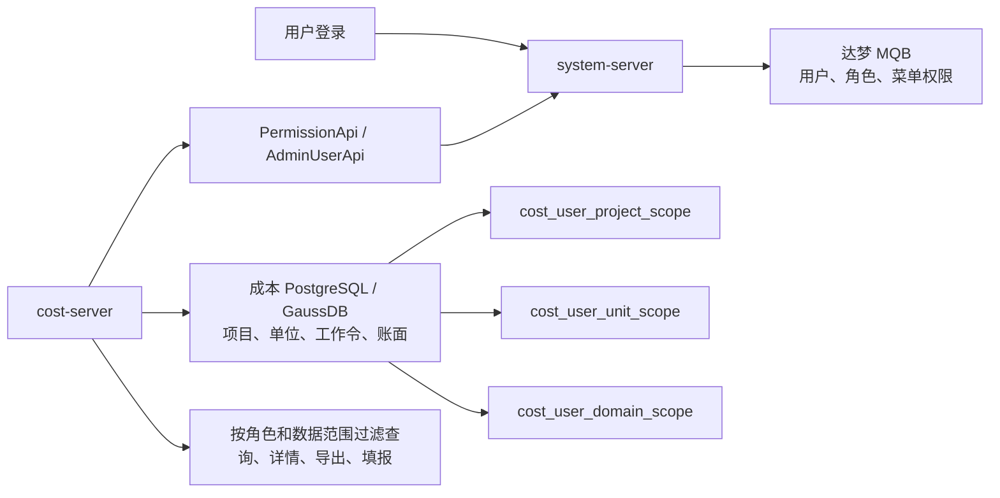

# 成本树四类角色权限与双库初始化

更新时间：2026-08-19

> 文件名为兼容既有文档和离线包复制链保留；当前实际为四类普通成本角色。

本文用于说明成本树权限数据分别存在哪里、首次如何初始化、已有中台用户如何授权，以及后续排障时应检查哪张表。文中不保存账号、密码和内网地址。

## 1. 先记住两个数据库边界

成本树权限不是只靠一套表完成，而是“中台身份权限 + 成本数据范围”两部分组合。

| 数据库 | 当前典型方言 | 负责内容 | 关键表 |
|---|---|---|---|
| 中台平台库 | 达梦 DM8，schema 为 `MQB` | 登录用户、角色、接口权限、用户角色关系 | `SYSTEM_USERS`、`SYSTEM_ROLE`、`SYSTEM_MENU`、`SYSTEM_USER_ROLE`、`SYSTEM_ROLE_MENU` |
| 成本业务库 | PostgreSQL / PostgreSQL 9.2 / GaussDB 8.2.1 | 成本业务数据、用户可见领域、项目和管理单位 | `cost_user_domain_scope`、`cost_user_project_scope`、`cost_user_unit_scope` 及其他 `cost_*` 表 |

不能把两类脚本互换执行：

- 达梦角色脚本必须在中台平台库 `MQB` 执行。
- `12-upgrade-existing-to-20260817-access-scope.sql` 必须在成本业务库执行。
- `13-upgrade-existing-to-20260818-domain-scope.sql` 也必须在成本业务库执行。
- `14-upgrade-existing-to-20260819-manual-fields-subsystem.sql` 必须在成本业务库执行，用于阶段多选长度、分系统字典和纵向分工空值语义。
- 成本业务库使用 PostgreSQL，不代表平台角色脚本也要用 PostgreSQL；脚本方言取决于它实际操作的数据库。

`cost-server` 不直接读取 `MQB.SYSTEM_*` 表。它通过中台提供的 `PermissionApi`、`AdminUserApi` 获取当前登录用户和角色，再到成本业务库读取领域、项目或单位授权。

## 2. 四类成本角色

四个普通成本角色互斥，一个用户只能拥有其中一个。`super_admin` 和 `tenant_admin` 分别是中台超级管理员和租户管理员，均不需要再分配普通成本角色，并在当前租户内拥有完整成本管理权限。

| 角色名称 | 角色编码 | 页面入口 | 数据范围 | 可修改内容 |
|---|---|---|---|---|
| 成本全局查看 | `cost_global_viewer` | `/cost/index` | 全部项目和单位 | 只读、可导出 |
| 成本科研部 | `cost_research_department` | `/cost/index` | 管理员为账号绑定的一个领域 | 只读、可导出；当前无填报或审批 |
| 成本项目办 | `cost_project_office` | `/cost/catalog` | 管理员分配的项目 | 仅项目办填报 |
| 成本研制单位 | `cost_unit_user` | `/cost/catalog` | 管理员分配的项目与管理单位交集 | 仅交集范围内的工作令填报 |
| 超级管理员或租户管理员 | `super_admin` / `tenant_admin` | 全部 | 全部 | 维护成本数据授权 |

四个普通成本角色在若依通用部门数据权限中统一使用 `data_scope=5`（仅本人）。这是有意的安全边界：成本模块自己的全局/领域/项目/单位范围由 `CostAccessScopeService` 和三张 `cost_user_*_scope` 表控制，不能把成本角色改成通用 `data_scope=1`，否则会同时扩大用户在其他中台模块的数据范围。

当前角色脚本写入的接口权限如下：

| 角色 | 主要权限 |
|---|---|
| `cost_global_viewer` | 项目查询、项目填报查询/导出、工作令查询/导出、预警查询 |
| `cost_research_department` | 与全局查看相同的查询/导出权限，但后端强制限制为授权领域；当前不分配填报或审批权限 |
| `cost_project_office` | 项目查询、项目填报查询/新增/修改/导出、工作令查询/导出 |
| `cost_unit_user` | 项目查询、项目填报查询、工作令查询/新增/修改/导出 |

审批权限 `cost:project-basic:approve`、`cost:work-order:approve` 已作为独立权限点初始化，但默认不分配给普通填报角色，避免填报人审批自己的数据。

## 3. SQL 文件地图

### 3.1 中台平台库角色与权限

后端源码仓库中的原始脚本：

| 平台库方言 | 初始化脚本 | 校验脚本 |
|---|---|---|
| 达梦 DM8，`MQB` schema | `<backend-root>/sql/dm/costree-access-role-menu-20260817.sql` | `<backend-root>/sql/dm/check-cost-permissions-20260817.sql` |
| PostgreSQL 14+ | `<backend-root>/sql/postgresql/costree-access-role-menu-20260817.sql` | 离线包 `database/platform/check-cost-permissions.sql` |
| PostgreSQL 9.2 / GaussDB | `<backend-root>/sql/postgresql92/costree-access-role-menu-20260817.sql` | 离线包 `database/platform/check-cost-permissions.sql` |
| MySQL 8 | `<backend-root>/sql/mysql/costree-access-role-menu-20260817.sql` | 按 `required-permissions.txt` 核对 |

完整离线包生成后，统一从 `database/platform/` 选择脚本，不需要回源码仓库查找。

### 3.2 成本业务库数据授权表

| 成本业务库 | 旧库升级脚本 | 空库脚本 |
|---|---|---|
| PostgreSQL 14+ | 依次执行 `12-upgrade-existing-to-20260817-access-scope.sql`、`13-upgrade-existing-to-20260818-domain-scope.sql`、`14-upgrade-existing-to-20260819-manual-fields-subsystem.sql` | `<backend-root>/sql/postgresql/costree-cost.sql` |
| PostgreSQL 9.2 / GaussDB 8.2.1 | 依次执行 `12-upgrade-existing-to-20260817-access-scope.sql`、`13-upgrade-existing-to-20260818-domain-scope.sql`、`14-upgrade-existing-to-20260819-manual-fields-subsystem.sql` | `<backend-root>/sql/postgresql92/costree-cost.sql` |
| MySQL 8 | `costree-cost-20260817-access-scope.sql`、`costree-cost-20260818-domain-scope.sql`、`costree-cost-20260819-manual-fields-subsystem.sql` | `<backend-root>/sql/mysql/costree-cost.sql` |

旧库升级后必须执行同目录 `20-verify.sql`。空库只执行完整 DDL，不要再重复执行旧库增量链。

## 4. 首次初始化顺序

### 步骤一：确认租户

先确定目标用户所属租户 ID。脚本中的 `124` 是测试示例，内网租户不同则必须全文替换。平台角色、用户、成本业务数据和授权记录必须使用相同租户。

### 步骤二：升级成本业务库

1. 停止 `cost-server` 和数据同步任务。
2. 备份成本业务库。
3. 旧库按对应方言执行升级链，确保包含 `12-upgrade-existing-to-20260817-access-scope.sql`、`13-upgrade-existing-to-20260818-domain-scope.sql` 和 `14-upgrade-existing-to-20260819-manual-fields-subsystem.sql`。
4. 执行 `20-verify.sql`。
5. 确认存在 `cost_user_domain_scope`、`cost_user_project_scope`、`cost_user_unit_scope` 和 `cost_subsystem_dict`，结构版本为 `20260819`。

这一步只创建成本数据范围表，不创建中台用户或角色。

### 步骤三：初始化达梦平台角色

当前中台平台库为达梦时：

1. 在 Navicat 打开达梦连接，确认可查询 `MQB.SYSTEM_USERS`、`MQB.SYSTEM_ROLE`、`MQB.SYSTEM_MENU`。
2. 备份上述五张 `SYSTEM_*` 表，至少备份角色、菜单和两张关系表。
3. 打开 `costree-access-role-menu-20260817.sql`。
4. 把脚本中的租户 `124` 改为实际租户。
5. 在客户端关闭自动提交，整个脚本作为同一事务一次执行；任一步失败立即回滚。不要只截取中间的删除或插入语句执行。
6. 提交成功后执行 `check-cost-permissions-20260817.sql`。

达梦检查脚本的关键结果必须满足：

- 角色检查：`STATUS=OK`，`ACTUAL_COUNT=4`。
- 权限点检查：`STATUS=OK`，`MISSING_COUNT=0`。
- 缺失角色权限映射：`STATUS=OK`，`EXPECTED_MAPPING_COUNT=29`、`MISSING_COUNT=0`。
- 意外角色权限映射：`STATUS=OK`，`EXPECTED_MAPPING_COUNT=29`、`UNEXPECTED_COUNT=0`。
- 角色互斥检查：`STATUS=OK`，`CONFLICT_USER_COUNT=0`。

最后一个查询只是列出已分配用户。刚初始化但尚未给用户分配角色时为空是正常现象。

### 步骤四：给已有中台用户分配角色

不需要再执行 SQL。

1. 使用超级管理员或租户管理员登录中台。
2. 打开 `/system/role`，确认四个角色存在并启用。
3. 打开 `/system/user`。
4. 选择已有用户，点击“更多 -> 分配角色”。
5. 只选择一种成本角色并保存。

中台会自行维护 `MQB.SYSTEM_USER_ROLE`。不要手工插入该表，避免遗漏租户、逻辑删除和审计字段。

### 步骤五：分配成本数据范围

1. 使用 `super_admin` 或 `tenant_admin` 打开 `/cost/back/access-scope`。
2. 选择刚分配角色的用户。
3. 科研部账号选择且只能选择一个领域。
4. 项目办账号选择一个或多个项目。
5. 研制单位账号必须同时选择一个或多个项目和一个或多个院内管理单位。
6. 全局查看账号无需配置领域、项目或单位。
7. 保存后让目标用户退出并重新登录。

这一步维护的是成本业务库：

- 项目办授权写入 `cost_user_project_scope`。
- 科研部授权写入 `cost_user_domain_scope`；唯一键为 `(tenant_id, user_id)`，后端通过物理删除旧记录再插入新记录完成换领域。
- 研制单位项目授权写入 `cost_user_project_scope`，单位授权写入 `cost_user_unit_scope`；实际可见范围取两个集合的交集。

## 5. 日常维护规则

### 新增用户

先在中台用户管理创建用户，再在页面分配一种成本角色，最后到成本数据授权页分配范围；科研部必须分配一个领域，研制单位必须同时分配项目和单位。不要直接往成本业务库创建“用户”。

### 用户换岗

1. 在 `/cost/back/access-scope` 清理旧领域、项目或单位范围。
2. 在 `/system/user` 调整成本角色，确保只保留一种。
3. 配置新范围。
4. 用户重新登录并完成越权测试。

### 项目办授权

授权键为项目编码。项目停用或编码失效时不应自动扩大权限，应由超级管理员修正授权。

### 科研部授权

授权键为稳定的 `domain_code`，每个账号恰好一个领域，且同租户至少存在一个该领域的活动项目。页面换领域时必须在同一事务内物理删除该用户旧授权后插入新授权；`deleted` 字段仅用于兼容通用数据模型，当前授权流程不保留逻辑删除记录。科研部当前只有查看和导出能力，后续填报审批流程落地前不得提前加入 `create`、`update` 或 `approve` 权限。

### 研制单位授权

研制单位必须同时保存项目编码和稳定的 `manage_unit_code`，页面显示项目及 `manage_unit_name`。实际范围按“授权项目 AND 授权管理单位”取交集；工作令单位还必须能经 `cost_unit_dict` 映射到该管理单位。任一范围为空，或单位字典缺失、停用、名称口径不一致时，系统不放行数据。

## 6. 验收清单

至少准备五个账号：超级管理员、全局查看、科研部、项目办、研制单位。

| 检查项 | 预期结果 |
|---|---|
| 全局查看登录 | 默认进入 `/cost/index`，能查看和导出全部数据，无新增、编辑、审批、删除 |
| 科研部登录 | 默认进入 `/cost/index`，只查看和导出授权领域，无新增、编辑、审批、删除 |
| 项目办登录 | 默认进入 `/cost/catalog`，只看到已授权项目，采集页只有项目办填报 |
| 研制单位登录 | 只看到同时属于授权项目和授权管理单位的数据，采集页只有研制单位填报 |
| 超级管理员或租户管理员登录 | 能打开 `/cost/back/access-scope` 并保存项目/单位范围 |
| 修改 URL 访问未授权项目 | 返回 403 或空数据，不能只依赖前端隐藏 |
| 导出未授权范围 | 不得导出其他项目或单位数据 |
| 研制单位交叉越权 | “授权项目 + 未授权单位”和“未授权项目 + 授权单位”均无列表、详情和导出数据 |
| 一个用户误配两个成本角色 | 成本模块拒绝访问并提示角色冲突 |

## 7. 常见问题

### 达梦报 `current_database` 无法解析

原因是把 PostgreSQL 脚本执行到了达梦。当前事务若已失败，先回滚，再执行达梦版本脚本。不要把 PostgreSQL 的 `setval`、`pg_*`、`CREATE TEMP TABLE` 语法改几处后继续使用。

### 四个角色存在，但用户登录后没有成本权限

按顺序检查：

1. `/system/user` 是否真的分配了一个成本角色。
2. 用户和角色 `tenant_id` 是否一致。
3. 科研部、项目办或研制单位是否已在 `/cost/back/access-scope` 保存相应范围。
4. 用户是否退出并重新登录以刷新权限缓存。

### 用户能看目录，但没有项目卡片

- 项目办：检查 `cost_user_project_scope.project_code` 是否存在于 `cost_project`。
- 科研部：检查 `cost_user_domain_scope.domain_code` 是否与 `cost_project.domain_code` 及领域主数据一致，并确认同一用户只有一条授权。
- 研制单位：先检查 `cost_user_project_scope.project_code`，再检查 `cost_user_unit_scope.manage_unit_code`、`cost_unit_dict`、单位金额和工作令的单位口径。
- 三类受限账号都要检查成本数据租户是否与登录用户租户一致。

### 修改前端参数能看到其他数据

这是后端数据范围未覆盖接口的安全问题，不能用隐藏按钮解决。应检查 `CostAccessScopeService` 是否在该列表、详情、导出或保存接口执行了领域、项目和单位校验。

### 是否可以直接修改 `SYSTEM_USER_ROLE`

正常运维不建议。现有用户和角色分配应统一走中台页面；只有中台页面不可用且经过 DBA 审批、备份和字段核对后，才考虑临时 SQL，并在恢复页面后重新核验。

## 8. 脚本职责边界

达梦初始化脚本会：

- 创建隐藏的成本接口权限目录和 18 个接口权限点。
- 创建或复用四个成本角色。
- 重建这四个角色的 29 对成本接口权限映射。

达梦初始化脚本不会：

- 创建登录用户或修改密码。
- 自动给用户分配角色。
- 写入领域、项目或单位授权。
- 修改成本业务数据。

因此首次上线必须完成“平台角色初始化、用户角色分配、成本数据范围分配”三个步骤，缺少任一步都会表现为页面无权限或数据为空。
